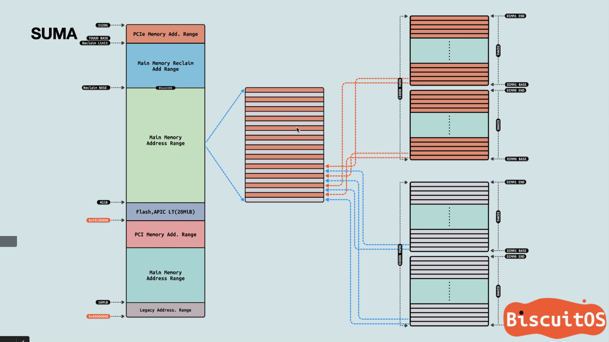

# Memory Deep Dive
## Memory Subsystem Organisation

### 内存子系统带宽
内存子系统带宽受到多种因素的影响
1. 每个cpu内存channel里的rank数量：每个cpu内存channel里的rank增多，（所需要的电压就越大，为限制功耗）会导致内存频率的下降。
2. 
### 选择建议
通常内存控制器会有单通道最大rank数量的限制，所以如果要特大容量的内存的话LRDIMM就是首选了。不然可以选择RDIMM进一步提高带宽和减少延迟
## Memory Subsystem Bandwidth
**per channel width(bits/transfer) x channel count x transfers/second = bps**
## Optimizing For Performance
### interleaving across channel 通道交替
多通道其实就是(cpu上/主板上)多个内存控制器交替访问。内存控制器会尽可能多地将内存通道组合为一个region，一个region内的DIMM数量最高可以和通道数量持平，此时这个region的吞吐率最高。多个内存控制器会交替访问不同的region。
> 这里牵涉到DPC(DIMM per Channel), 通常情况下DPC为2的情况下不会对吞吐率的影响不会太大，但当DPC到3时情况会变得很微妙，会导致内存频率下降甚至主板根本不支持，所以尽可能不要让DPC到3
> 
> 
### interleaving across rank rank交替
当每个channel上的DIMM上存在两个及以上rank时，内存控制器可以在rank上交替并发操作。这个可以减少latency。
## NUMA and data locality
CPU的处理性能和内存的访问性能间的差距，随着单核CPU技术的发展一直在变大。到2004年单核CPU的发展遇上了功耗墙导致CPU向多核发展，但内存和CPU的差距仍然存在，进一步来说，多核CPU对内存访问提出了更大带宽的要求。
### Parallel Memory Architect
### Memory Interleaving

内存channel增加了 但 访问是顺序访问 还是访问了同一块内存
所以有了memory （channel）interleaving 尽可能增加带宽的同时减小延时（看具体配置） 
让顺序访问的物理内存是不同通道上的内存条提供的
interleaving的粒度可能是4k 8k 2m
## terms
channel: CPU中的内存通道, 内存之所以有多通道是因为cpu集成了多个内存控制器。通常DDR\DDR2\DDR3\DDR4接口都是64比特的channel width
Error Checking and Correction (ECC) memory: 错误检测，可能会导致2~3%性能损耗
region：如果一个region没有用满所有的memory channel 那么这个region的吞吐量就没用满的那么高，所以插内存的时候尽量在一个region插满，而不是插到两个region上
## 命令
``` bash
dmidecode -t memory
```
## 参考
1. https://frankdenneman.nl/2015/02/20/memory-deep-dive/
2. https://en.wikipedia.org/wiki/Memory_bandwidth
3. https://www.intel.com/content/www/us/en/support/articles/000055509/server-products/server-boards.html
4. https://www.intel.com/content/www/us/en/support/articles/000005657/boards-and-kits.html