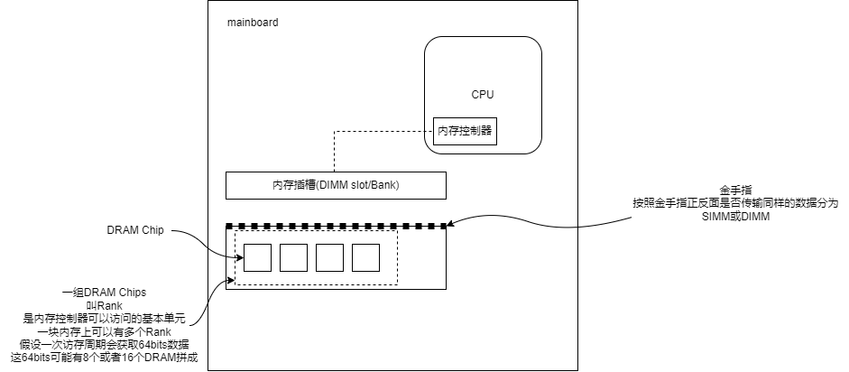
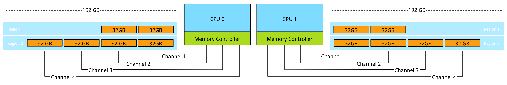
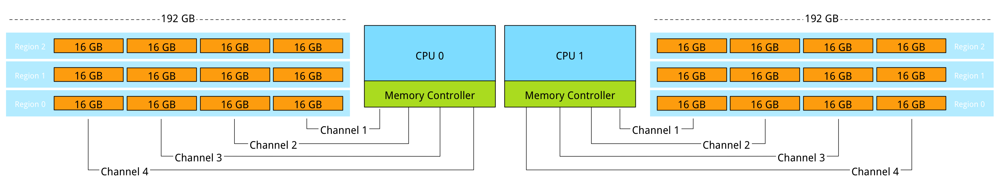

# Memory Deep Dive
## Memory Subsystem Organisation

### 发展
1. SIMM(Single Inline Memory Module): 金手指两侧提供相同的信号
2. DIMM(Dual Inline Memory Module, 双列直插内存模块): 内存金手指两端不互通，可各自传输信号。相比SIMM调高了内存速率，降低了功耗
3. UDIMM(Unregistered/Unbuffered DIMM,无缓冲双列直插内存模块): 最开始的DIMM，无缓冲双列直插内存模块，指地址和控制信号不经缓冲器，无需做任何时序调整，直接到达DIMM上的DRAM芯片。UDIMM由于在CPU和内存之间没有任何缓存，因此同频率下延迟较小。
4. RDIMM(Registered DIMM,带寄存器的双列直插内存模块): 带寄存器的双列直插内存模块。RDIMM在内存条上加了一个寄存器进行传输，其位于CPU和内存颗粒之间，既减少了并行传输的距离，又保证并行传输的有效性。由于寄存器效率很高，因此相比UDIMM，RDIMM的容量和频率更容易提高。
5. LRDIMM(Load Reduced DIMM,低负载双列直插内存模块): DDR3出现的技术，使用比RDIMM简单的缓冲（非寄存器）可缓存同时控制总线和数据总线访问，减少了主板上的电压负载，可以进一步提升内存频率，以及内存容量。但如果开启了rank复用模式下，因为内存板上寄存器的原因，内存控制器无法知道访问的rank是否位于同一个DIMM上，所以需要花费时间切换DRAMS，这可能会带来25%的性能损耗
6. 搭配可感知Rank的内存控制器的LRDIMM: 2012后第二代DDR3平台的内存控制器可以感知到LRDIMM片上缓存后面的物理rank，使得其可以对访问有更细微的控制（时间上等），减少了LRDIMM与RDIMM间延迟差距和带宽差距。DDR4有了更进一步的提高
### 内存子系统带宽
内存子系统带宽受到多种因素的影响
1. 每个cpu内存channel里的rank数量：每个cpu内存channel里的rank增多，（所需要的电压就越大，为限制功耗）会导致内存频率的下降。
2. 
### 选择建议
通常内存控制器会有单通道最大rank数量的限制，所以如果要特大容量的内存的话LRDIMM就是首选了。不然可以选择RDIMM进一步提高带宽和减少延迟
## Memory Subsystem Bandwidth
**per channel width(bits/transfer) x channel count x transfers/second = bps**
## Optimizing For Performance
### interleaving across channel 通道交替
多通道其实就是(cpu上/主板上)多个内存控制器交替访问。内存控制器会尽可能多地将内存通道组合为一个region，一个region内的DIMM数量最高可以和通道数量持平，此时这个region的吞吐率最高。多个内存控制器会交替访问不同的region。
> 这里牵涉到DPC(DIMM per Channel), 通常情况下DPC为2的情况下不会对吞吐率的影响不会太大，但当DPC到3时情况会变得很微妙，会导致内存频率下降甚至主板根本不支持，所以尽可能不要让DPC到3
> 
> 
### interleaving across rank rank交替
当每个channel上的DIMM上存在两个及以上rank时，内存控制器可以在rank上交替并发操作。这个可以减少latency。
## terms
DDR(Double Data Rate): 是按照内部技术对内存的分类，全名是DDR SDRAM(Synchronous Dynamic Random Access Memory，同步动态随机存储器)，含义是在时钟的电压上升沿和下降沿都会发生数据传输。所以DDR内存的MT/s (mega transfers per second)是IO bus频率的两倍。
channel: CPU中的内存通道, 内存之所以有多通道是因为cpu集成了多个内存控制器。通常DDR\DDR2\DDR3\DDR4接口都是64比特的channel width
Error Checking and Correction (ECC) memory: 错误检测，可能会导致2~3%性能损耗
region：如果一个region没有用满所有的memory channel 那么这个region的吞吐量就没用满的那么高，所以插内存的时候尽量在一个region插满，而不是插到两个region上
## 参考
1. https://frankdenneman.nl/2015/02/20/memory-deep-dive/
2. https://en.wikipedia.org/wiki/Memory_bandwidth
3. https://www.intel.com/content/www/us/en/support/articles/000055509/server-products/server-boards.html
4. https://www.intel.com/content/www/us/en/support/articles/000005657/boards-and-kits.html