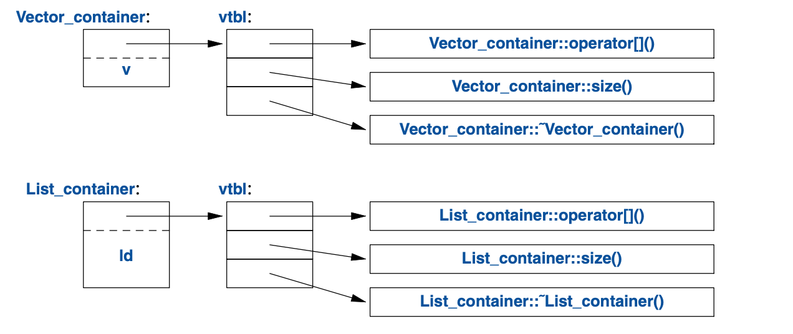

# C++

## 基础
C++ 是静态类型语言。提供到硬件的直接映射。C++语言的设计思想也映射了冯·诺伊曼计算机架构
- Memory 映射 各种数据，是最重要的部分。
- 计算单元 映射 基础计算符，是对数据的操作。
- 控制单元 映射 控制语法。

除了对数据的组合以外，对计算单元和控制单元的组合也是一种数据（函数）。
- 数据类型是抽象的，由编译器维护的，不占据内存空间的。
- 数据实体（或者叫变量，常量是一种不可变更的变量）是具体的，需要占据内存空间的。

这里就要引入数据类型的两个概念
- 接口：对外部暴露的，是数据物理排布和数据操作的约束定义。在语言层面也叫声明。
- 实现：对内部封装的，是数据物理排布和数据操作的具体实现。在语言层面也叫定义。

对于一个数据实体来说， C++ 定义了一个作用域的概念，也就是数据实体的生命周期，并规定了数据实体的接口。
1. 声明（declaration）：将数据实体引入到作用域，规定实体的类型。本质上是规定了数据在内存空间的排布和操作方法。
2. 初始化：数据实体在使用前必须被初始化，最好紧跟初始化。本质是为了防止内存空间上非法数据造成的影响
3. 转移：数据在作用域间（通常是上级作用域向下级）转移。本质是把数据从源数据实体所占用的内存空间拷贝到目的数据实体。
4. 销毁：在作用域结束时，作用域中的数据实体就会被销毁。本质是释放数据实体所占用的内存空间。

## 用户定义数据类型 - 面对对象编程
C++ 语言中的基础设施——基本类型、运算符和语句，从本质上讲都是用来辅助定义更好的用户定义数据类型以及更便捷地使用它们。

在设计上，一方面，把具体数据和运算分离有它的优势，比方说，能够随心所欲地使用数据。另一方面，通过把数据实体和数据操作绑定为用户定义数据类型来封装复杂度也有优势，可以确保该数据类型的封装性。

在 C++ 中，用户定义数据类型一样是一种数据实体，所以也要满足 C++ 中对数据实体的接口。后面对于用户定义数据类型以 C++ 中的 `class` 为例。

1. 声明： `class` 的声明。其中接口由类的 public 成员定义，而 private 成员是不希望向外保留的实现细节。
2. 初始化： 构造函数
3. 转移： 赋值函数，拷贝函数，转移函数
4. 销毁： 析构函数

5.3
在采用垃圾回收器之前，请先系统化地使用资源执柄： 让每个资源都有个位于某个作用域内的有所有者，并且所有者在作用域结束处释放该资源。

在C++里，这叫 RAII（资源请求即初始化 Resource Acquisition Is Initialization）， 它已经跟错误处理机制中的异常整合在一起。 资源可以通过转移的语意或者“智能指针”，从一个作用域移到另一个作用域， 还可以通过“共享指针（shared pointer）”表示共享的所有权。

### 声明

C++的声明的具体实现上，包含我们之前提到 C++ 中对数据实体的接口。类的声明和实现参考**零规则（the rule of zero））**： 要么定义全部基础操作，要么全不定义（全用默认实现）。

``` c++
class X {
    // 可以为成员变量提供默认初始值
public:
    X(Sometype)             // “常规构造函数”：创建对象
    X();                    // 缺省构造函数
    X(const X&)             // 拷贝构造函数：定义了对象如何pass by value（比如作为函数参数和返回值时的以值传递）
    X& operator=(const X&); // 拷贝赋值：清理目标对象并拷贝
    ~X();                   // 析构函数：清理资源
                            // 以上函数如果不实现，c++会自动提供默认实现
    
    X(X&&);                 // 转移构造函数
    X& operator=(X&&);      // 转移赋值：清理目标对象并转移
    // ...
};
```

优秀的程序组织方法是把程序当作一组明确定义了**依赖关系**的模块，利用语言的特性表达这种模块间的逻辑关系，再把这种关系通过文件的形式展现。这样的组织方式不仅易理解易管理，且可以实现高效的分离编译。

C++ 中可以被独自（包括#include进来的.h文件）编译的.cpp文件，叫做编译单元（translation unit）。 一个程序可以由数以千计的编译单元组成。C++支持对编译单元分离编译。因为一份声明可能在多个地方使用，C++ 中一般会把声明放在头文件中，这样可以在多个编译单元（即.cpp 文件）中多次出现，但要在不同编译单元中的相同的声明要保持一致性。

由于使用#include的方式过于简单，常常导致声明和宏冲突、覆盖等的问题。C++进一步 引入了命名空间（`namespace`）机制来优化管理(避免在头文件里使用`using`)。另外，C++ 20 中引入了 `module` 来进一步优化管理。

#### 不同类型的声明

- 实体类型：声明包含数据本身和对数据的操作定义

1. 普通类型：声明包含数据内容和操作的定义和约束
2. 容器类型：声明包含普通类型的集合以及对这个数据集合操作的定义和约束。

实体类型是最简单的类。情况许可的时候，请优先用实体类，而非更复杂的类或者普通的数据结构。避免提前抽象带来的复杂度。对于性能要求严苛的组件，也请优先用实体类，组合优于继承。

如果一个类X的数据内容比较复杂或者说析构函数中有一些不容忽视的任务，比如自由存储区资源回收或者释放锁，那这个类很可能就需要实现一整套类的基本操作。

- 抽象类型：声明进一步抽象，放弃数据内容的定义和约束，仅包含对数据操作的定义和约束，即接口，由具体的实体类型（派生类）实现其接口。

需要接口和实现完全分离的时候，请用抽象类作为接口。正因为抽象类放弃了数据内容的定义和约束，所以其通常不需要构造函数。抽象类型的函数会使用`virtual`关键词限定，这个词的意思是“后续可能在从此类派生的类中被重新定义”。用`virtual`声明的函数自然而然的被称为虚函数（virtual function）。如果有进一步使用 `=0` 限定则为纯虚函数，含义是继承自此抽象类型的类必须实现该函数。带有虚函数的类，最好一并定义虚析构函数。另外在派生类中最好用`override`来表达对继承来的父类接口的覆盖实现。

```C++
class Container {
public:
    virtual double& operator[](int) = 0;    // 纯虚函数
    virtual int size() const = 0;           // const 成员函数 (§4.2.1)
    virtual ~Container() {}                 // 析构函数 (§4.2.2)
};
```

抽象类的虚函数需要动态绑定，因此，C++ 语言对于虚函数的实现是通过引用或指针进行操作，也正是过引用或指针进行操作提供了其灵活性。编译器把虚函数的名称转换成一个指向函数指针表的索引。 这个表格通常被称为虚函数表（virtual function table），或者简称vtbl。 每个带有虚函数的类都有自己的vtbl以确认其虚函数。



实体类型服务于实现。抽象类型服务设计。

#### 类的层次

C++ 中和所有面对对象一样有类层次（class hierarchy）的概念。通过派生/继承的方式定义一个新类时，可以添加新的成员变量和运算。这带来了极佳的灵活性，但同时又给逻辑混乱和不良设计提供了温床。

类的层次结构使得子可以复用父类的定义、实现和包含其中的约束。

可以使用`dynamic_cast`运算符来确认具体类，该运算被称为“属于……类别”或者“是……实例”运算。
- 当一个非指定类型可接受， 我们用指针类型作为`dynamic_cast`运算的结果。遇到非指定类型会使得指针为`nullptr`
- 当一个非指定类型不可接受，我们用引用类型。遇到非指定类型时，`dynamic_cast`运算会抛出`std::bad_cast`异常。

### 初始化 

C++中通过定义构造函数来消除了用户数据类型所包含的数据内容的未初始化问题。构造函数的语义即是**初始化**。

构造函数的初始化列表就是对成员变量的初始化，而在构造函数体中对成员变量赋值，就是对成员变量的赋值。

推荐尽可能使用初始化列表初始化所有成员变量（可以用空值初始化），因为可以避免一次对成员变量的默认构造函数和一次赋值操作（拷贝赋值），转而变为只有一次初始化操作（拷贝构造），还可以避免无初值导致的未定义行为。

> 注意 non-local static 对象的初始化：将non-local static对象的初始化放在一个函数中，调用函数获取其引用。这是一种朴素的单例模式，可以避免其初始化顺序问题。

##### 常规构造函数和默认构造函数

用户自主创建（临时）对象时调用。能够不带参数调用的构造函数叫默认构造函数（default constructor）。

添加`explicit`后可以依靠这类构造函数显示指定强制类型转换的实现，避免隐式类型转换

```c++
class Vector {
public:
    explicit Vector(int s); // 不会隐式从int转换到Vector，类型转换时会调用这个构造函数，而且尽量把explicit用于单参数的构造函数
    // ... 
};
```

##### 拷贝构造
在类内部具有指针成员变量时（常见于大多数**容器类**），最好手动时实现
一般在如下场景调用
1. 通过一个同类型的对象为一个对象初始化
2. 作为函数参数传入
3. 作为函数参数传出
4. 作为一个异常

有时会想显示控制默认实现的生成,默认的实现就是对所有成员变量的值的逐个拷贝复制
```c++
class Y {
public:
    Y(Sometype);
    Y(const Y&) = default;  // 我确定想要默认的拷贝构造函数
    Y(Y&&) = default;       // 以及默认的转移构造函数
    // ...
};
```
有时还会需要指定不生成实现，比如基类中就不希望其将成员逐个拷贝复制
```c++
class Shape {
public:
    Shape(const Shape&) =delete;            // 没有拷贝操作
    Shape& operator=(const Shape&) =delete; // 没有拷贝赋值操作（主要是说明一下=delete的用处）
    // ...
};
```

### 转移

数据的转移有五种情形：

1. 赋值给另一个对象
2. 为一个对象提供初值
3. 作为函数参数
4. 作为函数的返回值
5. 作为一个异常

赋值操作采用拷贝或者转移运算符。原则上，其它情形均使用拷贝或者构造函数。 不过，拷贝或转移构造函数的调用通常会被优化掉，方法是把初始值直接在该对象上进行构造。

数据通过参数的方式从作用域转移到函数作用域以及通过返回值转移到上层作用域的机制都是复制，这是硬件实现抽象决定的。
所谓的传引用，不过是引用这种数据类型相比于其所指的数据类型复制时的成本更低。有时传引用会对数据类型的封装性造成破坏，一般通过添加限定关键词来给引用类型增加约束。
值返回时，函数的作用域结束，函数内部的数据将被销毁，要将需要的数据转移到上层作用域。有几种方式，
1. 数据实体除自身以外，内部不含指向函数作用域内的数据实体，可以直接通过返回值转移。
2. 在函数参数中转移了指向外部作用域数据实体的引用类型数据实体，函数内部即可使用引用类型数据实体直接操作外部作用域的数据实体。
3. 用`new`方法或者某些数据类型的构造函数内部有`new`方法，拿到外部作用域的内存空间（也就是数据实体），通过返回值转移指向这块内存空间的引用类型数据实体（[转移构造函数](todo)）

> C++中支持的返回值的结构化绑定，我理解是一种语法糖

### 销毁
我们需要一个机制确保把构造函数分配的内存释放掉； 这个机制就是析构函数（destructor）：

> 初始化-构造函数-申请资源&初始化资源、销毁-析构函数-释放资源的技术叫做**资源请求即初始化（RAII，Resource Acquisition Is Initialization）**。该技术为我们消灭“裸的new操作”，避免在常规代码中进行内存分配，将其隐匿于抽象良好的实现中。同样的，“裸的delete操作”也该竭力避免。 避免裸 new 和裸 delete ，能大大降低代码出错的几率，避免资源泄漏。

> 在需要释放操作时， 使用标准库的`unique_ptr`而非“裸指针”。使用`unique_ptr`可以让编译器隐式生成一个析构函数用于销毁对象。

### 语义

**`=`可以用于初始化和赋值，但两者语义本质是不同的**
初始化语义可以理解为对为初始化的内存的写入操作，也就是说对于未初始化的变量的使用（内存读取和写入）都是未定义行为（特别是未初始化的引用），变量生命周期仅有一次初始化。
赋值语义可以理解为简单的内存复制操作（MOV指令），变量生命周期中可以有多次赋值操作。

引用类型的特殊性可以很好的解释上述初始化语义和赋值语义的区别。
引用类型的初始化将绑定引用变量和被引用的变量。
引用类型初始化后的赋值将不改变引用的内存（即引用变量和被引用的变量绑定关系），而是给被引用的对象赋值（即访问被引用变量的值是自动（隐式）的。从这个角度看，引用就是c++提供的一种语法糖，使用上和普通变量一样）

### 赋值
赋值语义是内存复制操作，只有相同类型才有相同的内存布局，才能赋值。所以这里仅说明拷贝赋值
与上述**拷贝构造**做区分，是在赋值操作时调用，这也侧面印证了**初始化和赋值本质上是不同的**
与上述**拷贝构造**相同的是，在类内部具有指针成员变量时（常见于大多数**容器类**），最好手动时实现
```C++
class Vector {
private:
    double* elem;   // elem指向一个数组，该数组承载sz个double
    int sz;
public:
    Vector(int s);                          // 构造函数：建立不变式，申请资源
    ~Vector() { delete[] elem; }            // 析构函数：释放资源

    Vector(const Vector& a);                // 拷贝构造
    Vector& operator=(const Vector& a);     // 拷贝赋值

    double& operator[](int i);
    const double& operator[](int i) const;

    int size() const;
};
```
#### 转移 move语义
对于多数**容器类**，拷贝复制（深拷贝）操作代价高昂
一些场景下，被拷贝复制的变量，在未来将不被使用（内存读取和写入），则可以通过转移（浅拷贝）操作来减少操作成本，提高性能。
对象（及其资源）的生命周期与其作用域强相关，转移语义的含义是将一个作用域内的对象的资源（以较低的成本）转移到另一个作用域的对象，以改变对象内资源的生命周期。
转移语义的实际实现由类的转移构造函数和转移赋值函数实现
```c++
class Vector {
    // ...

    Vector(const Vector& a);            // 拷贝构造函数
    Vector& operator=(const Vector& a); // 拷贝赋值函数
    Vector(Vector&& a);                 // 转移构造函数
    Vector& operator=(Vector&& a);      // 转移赋值函数
};
```
根据传入的参数类型，类在使用中会自动从拷贝函数和转移函数中选择相应的函数执行。
需要转移（浅拷贝）操作时，就需要传入`Vector&& a`类型，这种类型就是右值（引用）类型。
一般化的理解，只可以出现在`=`的右边的就是一个右值(rvalue)，右值不可以出现在左边。我的理解是因为在传统编译器实现中,代码中`=`右边的token，一般在最终的汇编代码中会体现为一个寄存器上的值或是一个立即数（Immediate Value），作为指令的操作数是不出现在内存上的。所以一般右值的特征是临时的、匿名的、没有持久状态的、不能取地址（暂存于栈和寄存器上）的。
常见的右值包括：
1. 临时变量
2. 函数的返回

某些情况下，我们希望对一些是左值的变量做转移（浅拷贝）操作来减少代价（这种变量一般转移后就不会再使用了），此时就会使用`std::move(左值)`，`std::move()`只是一个类型转换器，将左值转为右值。如上所说，真正的转移操作在类的移动构造函数和移动赋值函数中实现。

##### 万能引用与完美转发 universal references and perfect forwarding
还有一个理解上有难度的点，c++中类型声明`&&`并不总代表右值引用类型
当类型声明表现为是`T &&`且T是一个被推导的类型（如auto、模板类型T）时，其类型就是一个万能引用。会根据传入的参数类型匹配为新类型
1. T &&碰到右值int &&， T匹配成int；
2. T &&遇到左值int ，也能匹配，T此时是int &。
3. T &&碰到左值const int，T匹配为 const int &。
4. T &&碰到左值const int *（指针类型）, T匹配为const int *& (下略）
5. T &&碰到左值const int * const（指针类型), T匹配为const int *const & （下略）

基于此，万能引用作为参数时，右值变量会被匹配为一个左值变量，则在这个函数中对这个变量使用时，其就和传入时的类型不同了（无法被作为右值调用转移（浅拷贝）操作），这就是这个变量作为右值被**不完美地转发**到了这个函数中。此时函数中就需要使用`std::forward<T>()`来保证其与传入时的类型保持一致，以达成完美转发。
> Fowarding Reference即当T &&和std::forward结合起来的时候，可以完美的传递其参数的category和const限定。
> X& &, X& &&, X&& & all collapse to X&
> X&& && collapses to X&&

### 基本操作总结

类型的构造函数、析构函数以及拷贝、转移这些操作的逻辑关系盘根错节。 定义它们的时候一定要彼此配合，否则就会带来逻辑或者性能方面的问题。

## 错误处理

C++ 的主要语言设施致力于设计并实现出优雅且高效的抽象（比如，用户定义类型和应用在它们之上的算法），期望这些高级别的设施带来的复杂度的封装可以简化编程，类型系统能帮助编译器捕获错误，以此来限制犯错误的几率（比如说，你不太可能尝试把树遍历算法应用在对话框上），

但是在程序运行时，仍会有错误发生。而且在调用栈上，错误发生点常常会比错误处理点深。这是源于复杂度逐层封装，具体的错误必然在封装之中。而困境在于，多数情况，上层接口调用者，无法接触到已经被封装好了的接口。

对此，有两种解法

### 破坏封装的完整度

接口对于错误主动开放一个后门。接口实现者检测到错误，可以沿调用栈逐级向上汇报（最好携带调用栈路径信息）。直到遇到可以处理此错误的地方。在 C++ 中就是有 `catch` 此类错误的地方。为了配合像上级抛出错误，错误处理机制将根据需要退出作用域，以便回退到有意处理该类错误的调用者，所以用`try`的作用域包含可能发生错误的程序块，出错时 RAII 会沿途调用析构函数。

还有一种就是通过返回来暴露特定的错误类型，这种更适合在直接调用者该处理某个错误的时候使用。

> 拿不定该用异常还是错误码的时候，用异常。不要在每个函数中都捕捉所有异常。

### 保持封装的完整度
接口通过手段增强约束，如果错误直接崩溃。
比如一个函数绝对不应该抛出异常，可以用`noexcept`声明它。万一还是抛出了错误，就会立即调用`std::terminate()`以终止程序。
另外，为类声称某个假设为真的约束被称为 类的不变式（class invariant），简称不变式（invariant）。对数据类型存在一些基本假设，将这类基本假设实现不变式，不满足不变式时拒绝运行（抛出异常）。设计上，**为类制定不变式（以确保成员函数有的放矢）的职责归构造函数， 而成员函数运行完成之后，要确保不变式依然成立。**

目前尚无通用和标准的方式书写不变式、前置条件等可选的运行时测试。需要在开发时通过测试、`assert`、`static_assert`(常用于泛型编程)等手段来约束。

### 总结

尽可能早设计错误处理机制。
围绕不变式设计错误处理策略，让构造函数建立不变式，如果做不到就抛出异常。
在设计早期就确定错误处理的策略
能在编译期检查的就在编译期检查

## 模板

### 奇技淫巧
当不知道模板类的具体类型时
```c++
// 声明一个模板类QWE，但不定义它
template <class T>
class QWE;

...
// 当使用QWE<T>时，T需要是一个具体的类型，否则会编译错误，这时报错会告诉你T的类型。
QWE<T> a;
```

## 标准库
一般情况，作用域控制资源的申请释放生命周期（RAII）
特殊情况，资源生命周期需要跨作用域使用智能指针（unique_ptr 和 shared_ptr）
很多情况下，使用variant都比union更简单也更安全。

## 参考
1. A Tour of C++
2. C++ primer