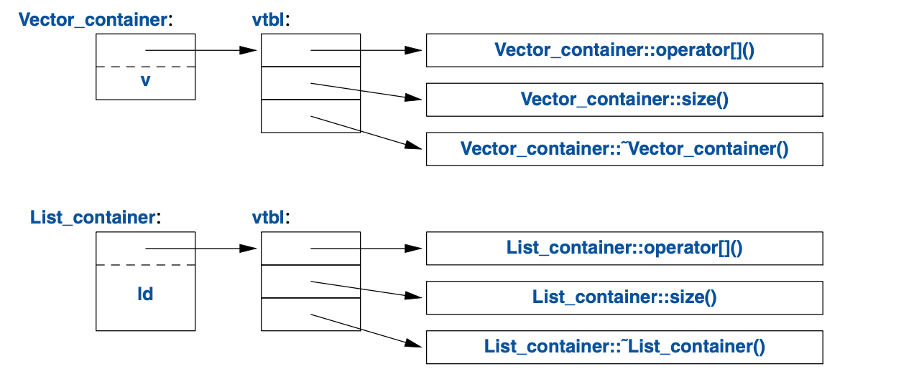

# C++

## 基本设计

C++ 是静态类型语言。提供到硬件的直接映射。C++语言的设计思想也映射了冯·诺伊曼计算机架构
- Memory 映射 各种数据，是最重要的部分。
- 计算单元 映射 基础计算符，是对数据的操作。
- 控制单元 映射 控制语法。

除了对数据的组合以外，对操作数据的计算单元和控制单元进行组合后就是函数，其本质也是一种广义上的数据。
这些广义上的数据有两层概念：
- **数据类型**是抽象的，由编译器维护的，不占据内存空间的。
- **数据实体**（或者叫变量，常量是一种不可变更的变量）是具体的，需要占据内存空间的。

这里进一步引入**数据类型**的两个概念
- 接口：对外部暴露的，是数据物理排布和数据操作的约束定义。在语言层面上描述接口的语句/动作/行为叫**声明（declaration）**。
- 实现：对内部封装的，是数据物理排布和数据操作的具体实现。在语言层面上描述实现的语句/动作/行为叫**定义**。

对于一个**数据实体**来说， C++ 定义了一个作用域的概念，用于界定数据实体的生命周期，在作用域内使用数据的操作接口包括：
1. **声明（declaration）**：首先需要将数据实体引入到作用域，约定数据实体的数据类型。本质上是规定了数据在内存空间的排布和操作方法。
2. **初始化**：数据实体在使用前必须被初始化，声明最好紧跟初始化。本质上是为了防止数据所使用的资源非法（比如内存上的非法数据）造成的影响。某种程度上可以说是一种特殊的**赋值**。
3. **释放**：在作用域结束时，作用域中的数据实体就会被释放。本质是释放数据实体所占用的资源。
4. **赋值**：本质上是数据实体的复制。常见场景是数据实体在作用域内复制/拷贝和作用域间转移。后者是希望在目的作用域使用源作用域的数据，所以要把源数据实体所占用的内存空间上的数据**复制/拷贝**到目的数据实体所占用的内存空间上。

### 作用域和生命周期

作用域按照不同的维度区分，存在下列类型
1. 局部作用域：在函数中使用数据。作用域从声明的地方开始，到声明语句所在的块（语句块边界由{}决定）结尾位置。函数参数也算在函数中使用，进入函数的过程即完成了声明与初始化，也就是转移。
2. 类作用域：在类及其定义中使用数据。作用域与类或类对象绑定。
3. 命名空间作用域：在命名空间中使用数据。作用域从声明的地方开始，到命名空间结束（即程序结束）为止。

数据实体在退出作用域时，其包含的资源会被释放。

对于一个系统来说，内存并非仅有的资源。资源是任何必须使用前（显式或隐式）申请，使用后释放的东西。 例子有内存、锁、socket、文件句柄以及线程句柄。内存以外的资源被称为非内存资源（non-memory resource）。
优秀的资源管理系统能处理所有类型的资源。在任何长时间运行的系统里，泄漏必须避免，但资源的过度占用跟泄漏一样糟糕。如果一个系统把内存、锁、文件等，都持有双倍时长，那它就需要双倍的资源供给。

有不同的资源管理方案：

1. 垃圾回收机制：一种全局（这种全局是相对的）资源管理机制。

2. RAII（资源请求即初始化 Resource Acquisition Is Initialization）。通过将资源的生命周期和作用域绑定。资源可以通过转移或者“智能指针”，从一个作用域移到另一个作用域，还可以通过“共享指针（shared pointer）”表示共享的所有权。C++ 中更倾向于使用这种方式管理资源。另外，C++ 中的 RAII 已经跟错误处理机制中的异常整合在一起。

精巧的垃圾回收机制实现可以使得其性能开销被抵消，但计算机系统越来越趋向于分布式 （想想缓存、多核心，以及集群），局部性比以往更重要了，RAII就是这样一种作用域分布式的资源管理方案。具体实现中，应该具体问题具体分析。将RAII与资源垃圾回收机制结合，比如一些资源天然地和作用域绑定，就使用RAII，一些资源天然地要跨作用域在多处代码块中被使用，则在更高层的地方使用RAII，而在使用时采用垃圾回收机制的方式实现，同时在底层系统化地使用资源句柄：让每个资源都有个位于某个作用域内的有所有者，并且所有者在作用域结束处释放该资源。

> 一般情况，作用域控制资源的申请释放生命周期（RAII）
> 特殊情况，资源生命周期需要跨作用域使用智能指针（unique_ptr 和 shared_ptr）

## 用户定义数据类型 - 面对对象编程

C++ 提供的内置基础设施——基本类型、运算符和语句是设计用于反映传统计算机硬件的能力。在此基础上，还增加了一套抽象机制，用来辅助定义**用户定义数据类型**以及更便捷优雅地使用它们的。

在设计实现用户定义数据类型过程中，数据和操作是否作为一个整体是重点设计决策，需要根据业务实际的需求进行抉择。
- 一方面，把具体数据和运算分离有它的优势，比如能够灵活自由地使用数据。
- 另一方面，通过把数据实体和数据操作作为一个整体绑定为用户定义数据类型来封装复杂度也有优势，这样自定义类型易于使用和修改，内部数据具有一致性和封装性。关键是要设计良好的接口，将接口和实现分离。

在 C++ 中，**用户定义数据类型**和基本类型一样是一种数据实体，同样要满足上述中对数据实体的接口要求。后面对于用户定义数据类型以 C++ 中的 `class` 为例。

1. 声明： `class` 的声明。其中接口由类的 public 成员给出，而 private 成员是不希望向外保留的实现细节。
2. 初始化： 构造函数
3. 释放： 析构函数
4. 赋值： 赋值函数，拷贝函数，转移函数

### 声明

C++ 中用户自定义数据类型的声明中需包含我们之前提到 C++ 中对数据实体的接口。类的声明和实现遵循**零规则（the rule of zero）**： 要么定义全部基础操作（接口），要么全不定义（全用默认实现）。

> Guideline： 如果类X的数据内容比较复杂或者说析构函数中有一些比如自由存储区资源回收或者释放锁之类的不容忽视的（我感觉是一些特殊资源管理）任务，那这个类最好实现一整套类的基本操作（遵循**零规则（the rule of zero）**）。而且类型的构造函数、析构函数以及拷贝、转移这些操作的逻辑关系盘根错节。 定义它们的时候一定要彼此配合，否则就会带来逻辑或者性能方面的问题。

``` c++
// 这里就是 数据类型 X 的声明
class X {
    // 可以为成员变量提供默认初始值
public:
    X(Sometype)             // 常规构造函数：创建对象，建立不变式，申请资源
    X();                    // 缺省构造函数
    ~X();                   // 析构函数：清理资源
    X(const X&)             // 拷贝构造函数：定义了对象如何pass by value（比如作为函数参数和返回值时的以值传递）
    X& operator=(const X&); // 拷贝赋值：清理目标对象并拷贝
                            // 以上函数如果不实现，c++会自动提供默认实现
    
    X(X&&);                 // 转移构造函数：当某些情况拷贝代价太大（比如搬运容器类型内所有的数据），我们希望以一种不破坏
    X& operator=(X&&);      // 转移赋值：清理目标对象并转移
    // ...
};
```

#### 声明的组织形式

优秀的系统组织方法是把系统当作一组明确定义了**依赖关系**的模块，利用语言的特性来表达这种模块间的逻辑关系，再把这种关系通过文件的形式展现。这样的组织方式不仅易理解易管理，且可以实现高效的分离编译。

从编译角度看，模块就是 C++ 中可以被独自（包括#include进来的.h文件）编译的.cpp文件，叫做编译单元（translation unit），C++ 支持对编译单元分离编译。
逻辑上，一份声明模块可能被多个其他模块依赖，物理上，C++ 中一般会把声明放在头文件（即.hpp 文件）中，这样的设计使得声明模块可以在多个编译单元（即.cpp 文件）中出现，这些同时被不同编译单元依赖的相同的声明也可以保持一致性，减少了维护的成本。

这种依赖关系，在 C 语言中使用 `#include` 的方式实现，但由于过于简单，常常导致声明和宏冲突、覆盖等的问题。C++ 引入了命名空间（`namespace`）机制来优化这种依赖关系的管理（避免在头文件里使用 `using`）（C++ 20 中进一步引入了 `module` 来优化管理）。

#### 不同类型的声明

- **具体类型**：声明包含数据本身和对数据的操作定义

    1. 普通类型：其代表了系统中对象的抽象。
        - 声明中包含的数据物理排布是基础类型或基础类型组成的普通类型的组合。
        - 声明中包含的数据操作是出于对单个数据的视角定义的。
    2. 容器类型：其代表了系统中对多个对象的组织的抽象。
        - 声明中包含的数据物理排布是普通类型的集合。
        - 声明中包含的数据操作是出于对数据集合的视角定义的。

> Guideline： 容器类型可以定义一个初始值列表构造函数（C++ core guidelines:C.103）

- **抽象类型**：在具体类型基础上，数据的声明进一步抽象，放弃数据内容的定义和约束（即放弃一部分狭义的数据声明，纯局部变量），只包含对数据操作的定义和约束（所以抽象类不能实例化，无构造函数，无拷贝函数，其析构函数是virtual的）。

具体类型若实现了某个抽象类型声明，即抽象类型对数据操作的定义和约束（无数据物理排布的约束定义），则此具体类型和此抽象类型构成了一种派生/继承关系，这种派生/继承关系的概念又称为类层次（class hierarchy），这种关系中抽象类型称为父类/基类，具体类型称为子类/派生类。类层次使得子类可以复用父类的定义、实现和包含其中的约束。同时，子类派生/继承一个父类时，除了实现父类的数据操作，还可以添加新的成员变量（数据物理排布）和运算（数据操作）。这带来了极佳的灵活性，但同时也给逻辑混乱和不良设计提供了温床。

**具体类型服务于实现。抽象类型服务于设计。**

可以使用`dynamic_cast`运算符来确认派生/继承关系，该运算的语义是“属于……类别”或者“是……实例”。
- 当一个非指定类型可接受， 我们用指针类型接收`dynamic_cast`运算的结果。遇到非指定类型会使得指针为`nullptr`
- 当一个非指定类型不可接受，我们用引用类型接收`dynamic_cast`运算的结果。遇到非指定类型时，`dynamic_cast`会抛出`std::bad_cast`异常。

系统中，具体类型是最简单的类。优先使用具体类型，可以避免提前抽象带来的复杂度。对于性能要求严苛的组件，最好也优先使用具体类型，而不是类层次，因为具体类型在编译时就知道了其数据物理排布，不需要运行时再判断。

当需要接口和实现完全分离的时候，用抽象类作为接口。正因为抽象类放弃了数据物理排布的定义和约束，所以其通常不需要构造函数。C++ 中抽象类型的函数会使用`virtual`关键词限定，这个词的意思是“后续可能在从此类派生的类中被重新定义”。用`virtual`声明的函数自然而然地被称为虚函数（virtual function）。如果有进一步使用 `=0` 限定则为纯虚函数，含义是继承自此抽象类型的类必须实现该函数。

> Guideline： 带有虚函数的类，最好一并定义虚析构函数。另外，在派生类中最好用`override`来表达对继承来的父类接口的覆盖实现。

> Guideline: 对于对称的运算符应当采用非成员函数。如果使用的是成员函数的话，就需要两个才行。 如果为（比如）== 采用的不是非成员函数的话，a == b 和 b == a 就会存在微妙的差别（C++ core guidelines:C.161）

```C++
class Container {
public:
    virtual double& operator[](int) = 0;    // 纯虚函数
    virtual int size() const = 0;           // const 成员函数 (§4.2.1)
    virtual ~Container() {}                 // 析构函数 (§4.2.2)
};
```

抽象类的虚函数需要动态绑定，因此，C++ 语言对于虚函数的实现是通过引用或指针进行操作，也正是通过引用或指针进行操作的设计提供了其灵活性。编译器把虚函数的名称转换成一个指向函数指针表的索引。 这个表格通常被称为虚函数表（virtual function table），或者简称vtbl。 每个带有虚函数的类都有自己的vtbl以指向其虚函数的定义。



#### auto 声明

C++ 提供了 `auto` 关键字来用初始化的值的类型本身来声明变量的类型。
> Guideline： 一般都可以使用 `auto` 来声明，除非
- 作用域很大，我们希望读者清楚的知道类型。
- 初始化表达式的类型（对读者来说）不是显而易见的
- 希望明确规定某个变量的范围和精度（比如用double不是float）

### 初始化 

若用户数据类型在使用前其所包含的资源的未初始化，则可能导致非法资源被当成正常资源被使用（比如内存上保留的非法数据）。C++ 中通过定义构造函数来消除此类问题。构造函数的语义即是**初始化**。

> Guideline： 尽量避免不初始化变量（C++ core guidelines:ES.20）且最好在初始化变量所需的数据准备好的时候，再声明并初始化变量，即变量声明尽可能贴近使用（C++ core guidelines:ES.21）

函数参数与返回值的基本语义是初始化。

> Guideline： 对变量进行初始化，最好使用{}列表形式，可以避免使用=带来的隐式类型转换导致的信息丢失。要尽可能避免窄化类型转换（C++ core guidelines:ES.46）

> Guideline： 构造函数的初始化列表就是对成员变量的初始化，而在构造函数体中对成员变量赋值，就是对成员变量的赋值。所以推荐尽可能使用初始化列表初始化所有成员变量（可以用空值初始化），因为可以避免一次对成员变量的默认构造函数和一次赋值操作（拷贝赋值），转而变为只有一次初始化操作（拷贝构造），还可以避免无初值导致的未定义行为，而且语义也更一致。

> Guideline： 注意 non-local static 对象的初始化：将 non-local static对象的初始化放在一个函数中，调用函数获取其引用。这是一种朴素的单例模式，可以避免其初始化顺序问题。

在[声明](#声明)章节中列举了不同的构造函数。

其中部分构造函数在 C++ 中会按需被编译器自动生成，如果你显式实现其中一部分，那其它的默认定义就不会再生成了。用户如果想显式控制默认实现的生成就如下添加上 `= default`，编译器默认的实现的本质就是对所有成员变量的值的逐个拷贝复制（是一种浅拷贝）。

```c++
class Y {
public:
    Y(Sometype);
    Y(const Y&) = default;  // 我确定想要默认的拷贝构造函数
    Y(Y&&) = default;       // 以及默认的转移构造函数
    // ...
};
```
用户如果想指定编译器不生成实现就如下添加上 `= delete`，比如类层次中的父类中就不希望编译器将其成员逐个拷贝复制

```c++
class Shape {
public:
    Shape(const Shape&) =delete;            // 没有拷贝操作
    Shape& operator=(const Shape&) =delete; // 没有拷贝赋值操作（主要是说明一下=delete的用处）
    // ...
};
```

#### 默认构造函数

默认构造函数（default constructor）是不带参数调用的构造函数，一般在用户自主创建（**临时**）对象时调用。

#### 常规构造函数

常规构造函数

```c++
class Vector {
public:
    explicit Vector(int s); // 不会隐式从int转换到Vector，类型转换时会调用这个构造函数，而且尽量把explicit用于单参数的构造函数
    // ... 
};
```

> Guideline： 常规构造函数中存在一些单个参数的，这部分常规构造函数有时会被作为隐式类型转换函数被误用（比如[赋值操作](#赋值操作符（=）)中）。通过添加`explicit`将构造函数显式指定强制类型转换的实现，避免隐式类型转换

#### 拷贝构造函数和移动构造函数
todo
拷贝构造函数是同类型的对象作为参数来进行构造。其本意是通过一个同类型的对象为一个对象初始化。但一般一个作用域中很少会需要两个同样类型同样数据的对象，更多情况下拷贝构造函数表现得更像是一种[转移](#赋值)的语义。

> Guideline： 一般在类内部具有指针成员变量时（常见于大多数**容器类型**），最好手动实现拷贝构造函数。

### 释放

用户数据类型对象在其生命周期结束时，需要确保把初始化时获取到的资源释放，避免资源泄露。此时就会调用析构函数（destructor）

手动直接调用析构函数 `obj.~T()`，只是执行析构的逻辑，**并不会把对象标记成 “已经释放”**；等到作用域结束，编译器依然会自动调用一次析构，造成**二次析构（double destruction），属于 UB 未定义行为**。

> 初始化-构造函数-申请资源&初始化资源、释放-析构函数-释放资源的技术叫做**资源请求即初始化（RAII，Resource Acquisition Is Initialization）**。该技术为我们消灭“裸的new/delete操作”，避免在常规代码中进行内存分配，将其隐匿于抽象良好的实现中。这种技术能大大降低代码出错的几率，避免资源泄漏。

> Guideline： 在使用指针的时候，使用标准库的`unique_ptr`而非“裸指针”。使用`unique_ptr`可以使得原本没有释放操作的指针对象，在编译器的帮助下隐式生成一个析构函数用于释放其指向的对象的资源。

### 赋值

数据对象在初始化之后，会根据业务需要改变其数据，将新的数据替换到数据对象上，此时的数据赋值/拷贝/移动就是**赋值**。常见场景是为了符合硬件中调用栈的设计以及在软件中复杂度层次化封装的需求，部分数据需要在作用域之间移动。

拷贝是赋值语义在 C++ 中默认的操作，但是对于一些复杂数据类型来说，拷贝的代价过高（特别是容器类型会存在多次拷贝），则需要通过**转移**来解决数据的移动。所以可以视转移为一种特化的拷贝。可以理解为：
- 拷贝：数据的值的复制
- 转移：数据的引用的复制

两者本质上都是一种复制，所以只能发生在相同类型的数据之间，这也是硬件实现抽象决定的。拷贝和转移常见的场景有：
1. 作为另一个对象初始化的数据被复制
2. 为一个对象赋值
3. 作为函数参数（实参->形参）
4. 作为函数的返回值
5. 作为一个异常

```c++
class Vector {
    // ...

    Vector(const Vector& a);            // 拷贝构造函数
    Vector& operator=(const Vector& a); // 拷贝赋值函数

    Vector(Vector&& a);                 // 转移构造函数
    Vector& operator=(Vector&& a);      // 转移赋值函数
};
```

赋值操作符`=`存在一定的复杂性，在于其使用中会根据部分成员函数的实现情况和数据对象状态的不同而展示出不同的语义（**初始化**或**赋值**中具体的拷贝或移动），在可读性上造成一定的困扰。

``` c++
Vector v0(3);           // 初始化语义：调用常规构造函数
Vector v1(v0);          // 初始化语义：调用拷贝构造函数
Vector v2 = v0;         // 初始化语义：调用拷贝构造函数
Vector v3;              // 声明
v3 = v0;                // 赋值语义：调用拷贝赋值函数
```

- 初始化语义如上所述，在数据的生命周期的起始发生，有且仅只有一次初始化操作。
- 赋值语义可以理解为简单的内存复制操作（MOV指令），在数据的生命周期中可以有多次赋值操作。

理论上说，对于未初始化的数据对象的读写操作都是未定义的行为，包括赋值。所以要想让赋值操作成功进行，被赋值的数据对象必须拥有一个有效的值（内存数据）也就是需要初始化。所以判断`=`是初始化语义还是赋值语义，即判断数据对象是否已经初始化，初始化过则是赋值，否则是初始化。

> 引用&类型的特殊性可以很好的解释上述初始化语义和赋值语义的区别。引用在语法上就严格保证了必须初始化后才能使用。所以对于引用&的=操作比较特殊（如 int& r = x;），其初次使用时必然是初始化（将r绑定到x）。引用&类型初始化后的赋值将不改变引用的内存（即引用变量和被引用的变量绑定关系），而是给被引用的对象赋值（即访问被引用变量的值是自动（隐式）的。此时，引用的使用上和普通变量一样，其实就是c++提供的一种语法糖）。

#### 值类别

转移函数设计到右值引用&&的概念，这里介绍一下。

C++98时期只有 lvalue / rvalue，rvalue 就是右值、字面量、临时对象，没有细分。
C++11引入了移动语义，把值类别拆出三层：
1. **lvalue 左值**
2. **prvalue pure rvalue 纯右值**：此时纯右值也是一种有内存的临时对象，常见于字面量，显式构造，返回无名临时对象的函数调用（上面的`func_return_complex`）
3. **xvalue expiring value 亡值**：已经存在的对象，快要销毁了，（内存）资源可以被移动，常见于std::move的参数
   - `std::move(obj)`、NRVO 关闭时`return tmp`产生的亡值
同时定义了 glvalue、rvalue 两个大类：
- `glvalue = lvalue + xvalue`
- `rvalue = prvalue + xvalue`：能绑定到 T&& 右值引用，都可以触发移动语义

C++17 之前所有 rvalue 都是临时对象，占有内存。C++17 开始将 prvalue 的定义改为以下规则，并带来了**实体化**规则
- **prvalue 纯右值**：只是描述了可以用来初始化某个对象的初始值（无内存）的表达式，可以用来推迟实例化的时机。当**需要一个实实在在的对象**的时候，编译器才根据这个 prvalue，新建一个有内存的临时对象，这就是**实体化**。如果不需要时，则直接跳过。
   - `complex(5)`、`func_return_complex()` 返回值

C++17 强制拷贝消除的底层原理是**跳过实体化**，实体化就需要调用构造函数。

C++17 标准规定：当一个 prvalue 直接用来**初始化**某个对象的时候，prvalue 不需要实体化；直接在目标对象的内存里执行构造，这就是**强制拷贝消除（mandatory copy elision）**。这也就是上述 c5 相比 c7 的 prvalue 少调用一次构造函数的原因。

##### move语义

return 局部自动变量，局部自动变量隐式转换成右值 xvalue

对于多数**容器类**，拷贝复制（深拷贝）操作代价高昂。一些场景下，被拷贝复制的变量，在未来将不被使用（内存读取和写入），则可以通过转移（浅拷贝）操作来减少操作成本，提高性能。
对象（及其资源）的生命周期与其作用域强相关，转移语义的含义是将一个作用域内的对象的资源（以较低的成本）转移到另一个作用域的对象，以改变对象内资源的生命周期。
转移语义的实际实现由类的转移构造函数和转移赋值函数实现
 
根据传入的参数类型，类在使用中会自动从拷贝函数和转移函数中选择相应的函数执行。
需要转移（浅拷贝）操作时，就需要传入`Vector&& a`类型，这种类型就是右值（引用）类型。
一般化的理解，只可以出现在`=`的右边的就是一个右值(rvalue)，右值不可以出现在左边。我的理解是因为在传统编译器实现中,代码中`=`右边的token，一般在最终的汇编代码中会体现为一个寄存器上的值或是一个立即数（Immediate Value），作为指令的操作数是不出现在内存上的。所以一般右值的特征是临时的、匿名的、没有持久状态的、不能取地址（暂存于栈和寄存器上）的。
常见的右值包括：
1. 临时变量
2. 函数的返回

某些情况下，我们希望对一些是左值的变量做转移（浅拷贝）操作来减少代价（这种变量一般转移后就不会再使用了），此时就会使用`std::move(左值)`，

`std::move()`只是一个类型转换器，将左值转为右值。如上所说，真正的转移操作在类的移动构造函数和移动赋值函数中实现。

##### 万能引用与完美转发 universal references and perfect forwarding

还有一个理解上有难度的点，c++中类型声明`&&`并不总代表右值引用类型
当类型声明表现为是`T &&`且T是一个被推导的类型（如auto、模板类型T）时，其类型就是一个万能引用。会根据传入的参数类型匹配为新类型
1. T &&碰到右值int &&， T匹配成int；
2. T &&遇到左值int ，也能匹配，T此时是int &。
3. T &&碰到左值const int，T匹配为 const int &。
4. T &&碰到左值const int *（指针类型）, T匹配为const int *& (下略）
5. T &&碰到左值const int * const（指针类型), T匹配为const int *const & （下略）

基于此，万能引用作为参数时，右值变量会被匹配为一个左值变量，则在这个函数中对这个变量使用时，其就和传入时的类型不同了（无法被作为右值调用转移（浅拷贝）操作），这就是这个变量作为右值被**不完美地转发**到了这个函数中。此时函数中就需要使用`std::forward<T>()`来保证其与传入时的类型保持一致，以达成完美转发。
> Forwarding Reference即当T &&和std::forward结合起来的时候，可以完美的传递其参数的category和const限定。
> X& &, X& &&, X&& & all collapse to X&
> X&& && collapses to X&&

#### 拷贝和移动

如果不显式实现拷贝系列函数，则编译器会自动实现隐式拷贝函数，现在先考虑有移动函数实现的情况（不管是隐式（complex）还是显式（Vector）），再考虑没有移动的实现的情况。

考虑一个具体类型中简单的普通类型 complex 和上述容器类型 Vector
```c++
class complex {
    double re, im;      // 表征数据：两个double
public:
    complex(double r, double i) :re{r}, im{i} {}    // 用两个标量构造complex
    complex(double r) :re{r}, im{0} {}              // 用一个标量构造complex
    complex() :re{0}, im{0} {}                      // complex的默认值：{0,0}
};
```

对于 complex 自C++11起，C++编译器会隐式实现
- 拷贝构造函数
- 拷贝赋值函数
- 转移构造函数
- 转移赋值函数
- 隐式析构函数

##### 普通类型

```c++
// 根据上述complex定义编译器会生成隐式拷贝构造/拷贝赋值/移动构造/移动赋值函数
complex func_return_complex() {
    return complex(5);                      // 返回一个无名临时对象
}

complex func_return_local_complex() {       // 整个函数调用表达式的结果是 prvalue
    complex tmp(10);                        // 变量 tmp 本身永远是 lvalue，变量的值类别不变
    return tmp;                             // 返回一个有名临时对象，是个lvalue
}

complex c1(1);                              // 常规构造函数
complex c2 = complex(2);                    // complex(2) 是 prvalue，强制拷贝消除，直接调用常规构造函数。
complex c3 = c1;                            // 拷贝构造函数
complex c4 = func_return_complex();         // func_return_complex() 是 prvalue，编译器会有强制的RVO返回值拷贝消除，和上面c2类似，会直接用函数内的参数为c4调用常规构造函数。
complex c5 = func_return_local_complex();   // 看是否开启NRVO拷贝消除。
                                            // 如开启会直接用函数内的参数为c5调用常规构造函数
                                            // 如果不开启这里tmp调用常规构造函数，return使得tmp隐式转为prvalue，prvalue可以直接为c5调用移动构造。
complex c6(6);
c6 = c1;                                    // 拷贝赋值函数
complex c7(7);
c7 = func_return_local_complex();           // 看是否开启NRVO拷贝消除。
                                            // 如果开启，tmp会调用常规构造函数，然后为c7调用移动赋值
                                            // 如果不开启这里tmp调用常规构造函数，return使得tmp隐式转为prvalue，prvalue需要实例化而调用移动构造函数，再用实例化后的prvalue为c7会调用移动赋值
```

移动系列函数隐式实现的前提条件更为苛刻，以下全部条件必须**同时满足**，编译器才会自动生成移动赋值：
1. 类没有用户显式声明移动系列函数
2. 类没有用户显式声明拷贝系列函数
3. 类没有用户显式声明析构函数
编译器在多数场景（返回值的重载决议、函数调用实参是右值、用右值初始化对象、赋值运算符）下会在拷贝和移动中优先选择移动。

```c++
// 假设complex定义了一个析构函数，则编译器不会为complex隐式实现移动构造/移动赋值
complex c5 = func_return_local_complex();   // 看是否开启NRVO拷贝消除。
                                            // 如开启会直接用函数内的参数为c5调用常规构造函数
                                            // 如果不开启这里tmp调用常规构造函数，return使得tmp隐式转为prvalue，prvalue可以直接为c5调用移动构造。但这里没有移动构造，则需要把tmp当成左值，回退为c5调用拷贝构造
complex c7(7);
c7 = func_return_local_complex();           // 看是否开启NRVO拷贝消除。
                                            // 如果开启，tmp会调用常规构造函数，然后为c7调用拷贝赋值
                                            // 如果不开启这里tmp调用常规构造函数，return使得tmp隐式转为prvalue，prvalue需要实例化而调用移动构造函数，再用实例化后的prvalue为c7调用移动赋值。但这里没有移动构造和移动赋值，所以prvalue需要实例化要调用拷贝构造函数，再用实例化后的prvalue为c7调用拷贝赋值
```

##### 容器类型

容器类型的特征是内部持有数据的引用（如 `Vector` 中的 `elem`），编译器隐式生成的拷贝系列函数是简单的逐个复制，此时不再正确（拷贝后两个对象的指针会指向同一块内存，析构时造成重复释放（double delete））。

所以容器类型必须显式实现析构函数和拷贝系列函数。又由于声明了析构/拷贝函数后编译器不再隐式生成移动系列函数，移动系列函数也必须一并显式实现（遵循**零规则**）。

```c++
class Vector {
    double* elem;   // elem 指向 sz 个 double（在自由存储区上申请）
    int sz;
public:
    explicit Vector(int s) :elem{new double[s]}, sz{s} {}  // 常规构造函数：申请资源，建立不变式（elem 指向 sz 个元素）
    ~Vector() { delete[] elem; }                           // 析构函数：释放资源

    Vector(const Vector& a)                                // 拷贝构造函数：深拷贝
        : elem{new double[a.sz]}, sz{a.sz}                 // 为目标对象申请自己的内存
    {
        for (int i = 0; i != sz; ++i) elem[i] = a.elem[i]; // 逐个复制元素，代价 O(n)
    }
    Vector& operator=(const Vector& a);                    // 拷贝赋值：释放自身资源并深拷贝（注意处理自赋值）

    Vector(Vector&& a) noexcept                            // 移动构造函数：窃取句柄
        : elem{a.elem}, sz{a.sz}
    {
        a.elem = nullptr;                                  // 把源对象置空：一方面防止其析构时重复释放（double delete），
        a.sz = 0;                                          // 另一方面维持其“elem 指向 sz 个元素”的不变式（空对象）
    }
    Vector& operator=(Vector&& a) noexcept;                // 移动赋值：释放自身资源并窃取

    double& operator[](int i) { return elem[i]; }
    int size() const { return sz; }
};
```

移动语义的价值在容器类型上才真正体现，拷贝和移动的代价差异显著：
- `complex`：拷贝和移动都是编译器隐式生成的成员逐个复制，代价几乎相同，移动基本不带来收益。
- `Vector`：拷贝是深拷贝（申请内存 + 逐元素复制，O(n)），移动只是复制指针并将源置空（O(1)）。

```c++
// 根据上述 Vector 定义（显式实现析构、拷贝系列、移动系列函数）
Vector func_return_vector() {
    return Vector(5);                      // 返回一个无名临时对象（prvalue）
}

Vector func_return_local_vector() {        // 整个函数调用表达式的结果是 prvalue
    Vector tmp(10);                        // 变量 tmp 本身永远是 lvalue，变量的值类别不变
    return tmp;                            // NRVO 关闭时 tmp 被隐式当作 xvalue（右值）参与重载决议
}

Vector v1(1);                              // 常规构造函数
Vector v2 = Vector(2);                     // Vector(2) 是 prvalue，强制拷贝消除，直接调用常规构造函数
Vector v3 = v1;                            // 拷贝构造函数（深拷贝，O(n)）
Vector v4 = func_return_vector();          // func_return_vector() 是 prvalue，强制拷贝消除，直接调用常规构造函数
Vector v5 = func_return_local_vector();    // 看是否开启 NRVO。
                                          // 如开启会直接用函数内的 tmp 为 v5 调用常规构造函数
                                          // 如不开启这里 tmp 调用常规构造函数，return 把 tmp 隐式当作 xvalue，为 v5 调用移动构造（窃取指针，O(1)）
Vector v6(6);
v6 = v1;                                  // 拷贝赋值函数（深拷贝）
Vector v7(7);
v7 = func_return_local_vector();          // 看是否开启 NRVO。
                                          // 如果开启，tmp 会调用常规构造函数，然后为 v7 调用移动赋值
                                          // 如果不开启这里 tmp 调用常规构造函数，return 把 tmp 隐式当作 xvalue，
                                          // 通过移动构造实体化返回对象（临时对象），再为 v7 调用移动赋值，最后临时对象析构

// 对左值也可以用 `std::move` 显式地施加移动语义（前提是确认该对象之后不再使用）：

Vector v10(std::move(v2));        // v2 之后不再使用：移动构造，v2 被掏空（elem == nullptr，sz == 0）
                                  // 此后 v2 处于“有效但内容未指定”的 moved-from 状态：
                                  // 可以安全地析构或赋新值，但不要假设其内容（更不要访问其元素）
```

与普通类型 `complex` 对照还有一种典型错误情形：如果 `Vector` 只实现了析构函数和拷贝系列函数（漏掉了移动系列函数），则由于“声明了析构/拷贝函数后编译器不再隐式生成移动”，上面所有本应移动的场景（v5、v7、v10）都会静默回退为深拷贝——功能上正确，但每次 `return`/赋值都会多付出一次 O(n) 的内存申请和逐元素复制。这正是容器类型必须成套定义五大基础操作的原因。

> Guideline： 移动构造/移动赋值函数应标记 `noexcept`。标准库容器（如 `vector`）扩容搬移元素时，只对 `noexcept` 的移动构造使用移动，否则会退回拷贝以提供强异常安全保证（C++ core guidelines:C.66）

##### 其他场景

**作为函数参数**
> 传引用是因为引用这种数据类型相比于其所指的数据类型复制时的成本更低。有时传引用会对数据类型的封装性造成破坏，一般通过添加限定关键词（比如`const`）来给引用类型增加约束。

**作为函数的返回值**
值返回时，函数的作用域结束，函数内部的数据将被释放，要将需要的数据转移到上层作用域。有几种方式，
1. 数据实体除自身以外，内部不含指向函数作用域内的数据实体，可以直接通过返回值转移。
2. 在函数参数中转移了指向外部作用域数据实体的引用类型数据实体，函数内部即可使用引用类型数据实体直接操作外部作用域的数据实体。
3. 用`new`方法或者某些数据类型的构造函数内部有`new`方法，拿到外部作用域的内存空间（也就是数据实体），通过返回值转移指向这块内存空间的引用类型数据实体

> C++中支持的返回值的结构化绑定，我理解是一种语法糖

## 错误处理

在程序运行时，会有**非预期**（大概率不会发生）的错误发生。
而且在为了符合硬件中调用栈的设计以及在软件中复杂度层次化封装的需求，错误影响程序运行的地方常常会比错误实际的源头更深，也就是在调用栈更深的地方。

为了防止错误发生，我们需要做两方面的工作
1. 处理已发生的错误
2. 预防未发生的错误

### 处理已发生的错误

接口对于错误主动开放一个后门。接口实现者检测到错误，可以沿调用栈回溯，逐级向上汇报（最好携带调用栈路径信息）。直到遇到可以处理此错误的地方，在 C++ 中就是有 `try-catch` 此类错误的地方。错误本身将根据需要退出当前作用域，并把上下文回溯到有意处理该类错误的调用者处(即有 `try-catch` 此类错误的地方)，出错回溯过程中 RAII 会沿着调用栈调用析构函数。当一个函数绝不应当抛出异常时，可以将其声明为 `noexcept` ,当有此声明的函数遇到错误时，系统会立即调用 `std::terminate`，不过这个要慎用。

还有一种就是通过返回值来暴露特定的错误类型。如果通过返回值来传递的话，需要逐层处理这种返回值型的错误，则在此调用栈上的所有代码块将不再满足单一职责，其语义必然包含正常业务处理和错误处理，使得复杂度变高，封装度变差。所以这种返回值型的错误类型更适合在直接调用者可以处理某个错误的时候使用。

> Guideline： 拿不定该用异常还是错误码的时候，用异常。但不要在每个函数中都捕捉所有异常。

### 预防未发生的错误

接口本身包含其声明中带有的关于输入参数的类型，和返回参数类型的约束，我们通过一些其他手段进一步增强接口的使用约束。比如一个函数绝对不应该抛出异常，用`noexcept`声明它;比如一个类成员函数不会改变对象的状态，则把他声明成 const。

为类声称某个假设为真的约束被称为 类的不变式（class invariant），简称不变式（invariant）。对数据类型和值存在一些基本假设，将这类基本假设实现不变式，不满足不变式时拒绝运行（抛出异常）。设计上，**为类制定不变式（以确保成员函数有的放矢）的职责归构造函数， 而成员函数运行完成之后，要确保不变式依然成立。**

目前尚无通用和标准的方式书写不变式、前置条件等可选的运行时测试。需要在开发时通过以下手段约束
- 测试
- `assert`
- `static_assert`（常用于泛型编程）：倾向于尽可能让错误在编译时被发现，

### 总结

尽可能早设计错误处理机制与策略，并且在开发过程中统一
围绕不变式设计错误处理机制与策略，让构造函数建立不变式，如果做不到就抛出异常。
不变式的检查要尽可能早，比如能在编译期检查的就在编译期检查

## 模板

### 奇技淫巧
当不知道模板类的具体类型时
```c++
// 声明一个模板类QWE，但不定义它
template <class T>
class QWE;

...
// 当使用QWE<T>时，T需要是一个具体的类型，否则会编译错误，这时报错会告诉你T的类型。
QWE<T> a;
```

## 参考
1. A Tour of C++
2. C++ primer