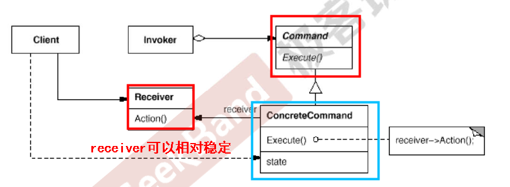

# GoF 23 Design Patterns
## 常用术语
扩展：（子类化）虚函数 + 子类 + 实现
运行时变化：虚函数 + 子类 + 运行时找到子类调用子类的虚函数，而非代码编写时的静态代码继承
## 组件协作模式
### Template Method 模板方法模式
#### 动机 Motivation
软件构建过程中，对某一任务存在
- 稳定的整体操作结构（前提条件）
- 变化的各个子步骤
- 或由于固有原因，无法和整体结构同时实现的模块
#### UML类图

#### 要点总结
1. Template Method非常基础也非常简洁
2. 晚绑定：不要调用我，让我来调用你
3. 其中虚函数可以实现也可以不实现，常用protected字段
### Strategy 策略模式
#### 动机 Motivation
软件构建过程中
- 变化的（广义）算法选择:(条件语句)
- 有条件语句带来的性能损耗
#### UML类图

#### 要点总结
1. 定义一系列算法，将其封装起来，并且使其可变化扩展。从而可以使调用算法的人在运行时切换不同算法
2. 消除了条件语句带来的性能负担。
### Observer/Event 观察者模式
#### 动机 Motivation
软件构建过程中
- 一种**通知依赖关系**——一个（目标）对象的状态发生改变，所有的依赖（观察者）对象都将得到通知。
上述依赖关系如果过于紧密则不能很好地抵御变化，因此使用观察者模式弱化依赖关系。
#### UML类图

#### 要点总结
1. 定义对象间的一种一对多（变化）的依赖关系，以便当一个对象（Subject）的状态发生改变时，所有依赖他的对象都得到通知并自动更新
2. observer模式可以使我们独立地改变目标与观察者
3. 目标发送通知时，无需指定观察者，通知会自动传播。
4. 观察者自己决定是否需要订阅，目标对象对此一无所知
### Decorator 装饰器模式
#### 动机 Motivation
软件构建过程中
- 扩展对象的功能：常常使用继承，但缺乏灵活性。使用组合来支持多态的变化
- 主体类有在多个方向上的扩展功能
需要动态的实现对象功能的扩展，避免其带来的子类膨胀的问题。
#### UML类图

#### 要点总结
1. （组合）动态地给一个对象增加一些额外的职责。装饰器模式可以消除重复代码&减少子类个数。
2. **既继承又组合**：Decorator类在接口上表现为is-a Component的继承关系，即Decorator类继承了Component类所具有的接口，但同时实现上又表现为has-a Component的组合关系，即Decorator类又使用了另一个Component类
### bridge 桥模式
#### 动机 Motivation
在软件构建过程中
- 固有类型的实现逻辑，有多个变化的维度
#### UML类图

#### 要点总结
1. 将多维度的变化分离为多个不同的类，可以运行时装配
2. 使用对象间的组合关系，解耦了不同维度变化的绑定关系
3. Bridge模式类似于多继承方案，多继承往往违背单一职责原则，复用性差，可用Bridge替换
4. Bridge模式一般应用在**两个非常强的变化维度**
### 工厂方法 Factory
#### 动机 Motivation
在软件构建过程的创建对象场景中
- 创建（变化的）具体类型
#### UML类图

#### 要点总结
1. 定义一个用于创建对象的工厂接口，让工厂子类决定实例化哪个具体类。Factory Method使得一个类的实例化延迟（目的：解耦，手段：工厂类的虚函数）到其具体子类，再使用时延迟到用户调用时（运行时）。
2. Factory Method模式用于隔离 类对象的使用者和具体类型之间的耦合。
3. Factory Method模式解决“单个对象”的需求变化，缺点在于要求具体对象的创建方法（参数，方法签名）相同
4. 可以是一个工厂类，也可以是一个抽象类方法
### Abstract Factory 抽象工厂
#### 动机 Motivation
在软件构建过程的创建对象场景中
- 一系列相互依赖的对象
#### UML类图

#### 要点总和
1. 提供一个接口，这个接口创建**一系列互相依赖**的对象。
2. 应对新系列不是应对新对象。
### prototype 原型
#### 动机 Motivation
在软件构建过程中
- （变化的）（复杂的）对象有（稳定的）接口
#### UML类图

#### 要点总结
1. 使用原型实例指定对象种类，然后通过深拷贝这些原型来创建
2. 当创建对象比较复杂时，导致工厂函数比较复杂时，可以考虑使用原型模式
3. 原型模式中的clone方法可以利用某些框架中的序列化来实现
### Builder 构建器
#### 动机 Motivation
在软件构建过程中
- 对象创建具体算法变化，主框架稳定（类似于模板方法），即分步骤构建复杂对象
#### UML类图

#### 要点总结
1. 将一个复杂对象的构建与其表示相分离，使同样（稳定）的构建过程可以有不同（变化）的表示。
2. 分步骤构建复杂对象，将分步骤这个行为再从构建中拆分出去
3. 注意不同语言中构造器内调用虚函数的差别
### Singleton 单件模式
#### 动机 Motivation
在软件构建过程中：
- 保证一个类仅仅存在一个实例，要绕过常规的构造器(两个场景,逻辑上只能有一个,性能上仅需要一个)
#### UML类图

#### 要点总结
1. 要考虑多线程情况(简单加锁\加双检查锁(volitile))
2. 实例构造器可以设置为protected(允许子类派生，但是得实现注册表功能，因为单件实现使用了静态变量，直接继承回使得派生类共享器静态变量)或private
3. 一般不支持拷贝构造函数和clone接口,不然就可能导致多个对象实例
### Flyweight 享元模式
#### 动机 Motivation
在软件构建过程中：
- 如采用纯粹对象方案会使得一些细粒度的东西随着开发充斥在系统中，难以管理并 带来运行时代价（内存损耗）
#### UML类图

#### 要点总结
1. 运用共享技术有效的支持大量细粒度的对象，主要用于性能问题
2. 对象创建后不能更改，要为只读模式
3. 综合考虑对象的多少，决定到底需要不需要这个模式
### Command 命令模式
#### 动机 Motivation
在软件构建过程中：
- 行为请求者与行为实现者通常呈现一种紧耦合，需要进行解耦
#### UML类图

#### 要点总结
1. 将请求封装为对象
2. ConcreteCommand有时候更具需要可能会保存一些额外的状态，以及可以将多个命令对象封装为一个复合命令对象。
3. 与c++中的函数对象相似，可以用函数对象替代
4. 用途：队列请求（因为可以将运算块打包以及异步调用，所以可以用在如调度、线程池、工作队列等情况下）、崩溃恢复（记录操作的日志，可以在重启系统后调用操作的execute()）
### Visitor 访问器模式
#### 动机 Motivation
在软件构建过程中：
- 需求的变化导致类层次接口需要添加新的行为（方法），要防止在基类中更改，给子类带来繁重的变更负担，甚至破坏原有设计。
- Element类层次结构是稳定的，但是其操作却需要频繁变动
#### UML类图

#### 要点总结
1. 两次派遣(double dispatch)来实现在不更改Element类层次结构的前提下可以添加新操作
2. Element的具体子类必须要稳定，不然visitor基类有得更改类的实现无法通过添加来扩展
3. 其适用情况为：Element类层次结构是稳定的，但是其操作却需要频繁变动
### Null object 空对象
#### 动机 Motivation
在软件构建过程中：
- 会有不需要返回一个有意义的对象，需要转嫁处理各种null的情况
#### UML类图
![]
#### 要点总结
1. 空对象要负责处理各种对象使用中的null情况

### Facade 门面模式
#### 动机 Motivation
在软件构建过程中：
- 需要解决系统间耦合的复杂度，用facade隔离
#### UML类图
![]
#### 要点总结
1. 为子系统中的一组接口提供一个一致（稳定）的界面，简化了整个组件系统的接口
2. facade模式更注重从架构的层次去看整个系统
3. facade模式中组件的内部应该是"相互耦合关系比较大的一系列组件"，而不是一个简单的功能集合
4. facade模式是解耦系统间（单向）的对象关联关系；Mediator模式是解耦系统内各个对象间（双向）的关联关系
### Proxy 代理模式
#### 动机 Motivation
在软件构建过程中：
- 在面向对象系统中，有些对象的直接访问比较麻烦（比如创建开销很大、或者有安全限制、或者需要进程外的访问等）。需要增加一层间接层来实现在不失去透明操作对象的同时来管理、控制这些对象特有的复杂性。
#### UML类图
![]
#### 要点总结
1. 思想是遵从proxy类和正式类的接口是一致的，具体proxy的实现差异很大（会实现很多细粒度的控制）
2. 分布式中应用广泛
3. 不用完全一致，可以损失一些透明性
4. 解决亚对象的接口
### Adapter 适配器
#### 动机 Motivation
在软件构建过程中：
- 由于应用环境的变化，常常需要将“一些现存的对象”到新环境中应用，但是现接口不满足新环境接口
#### UML类图
![]
#### 要点总结
1. 应用于“复用现存的类，但接口不一致”的情况。
2. 用组合的形式实现对象适配器（比较好），多继承的形式实现类适配器
3. 可以实现得非常灵活
4. 解决老新接口转换
### Mediator 中介者模式
#### 动机 Motivation
在软件构建过程中：
- 常常会出现多个对象互相关联交互的情况，对象之间会需要维持一种复杂（变化）的引用关系。
#### UML类图
![] 
#### 要点总结
1. 用一个中介对象来封装（封装变化）一系列对象的交互。中介者使得各对象不需要显式的相互引用（不需要编译时依赖）（要变成运行时依赖） 
2. Mediator模式将多个对象间的控制逻辑进行集中化管理，将交织的依赖关系交由中介者统一管理。随着管理控制逻辑的复杂化，Mediator具体对象的实现也会随之复杂，这时可以对其进行分解。
3. facade模式是解耦系统间（单向）的对象关联关系；Mediator模式是解耦系统内各个对象间（双向）的关联关系

#### 动机 Motivation
在软件构建过程中：
- 
#### UML类图
![]
#### 要点总结
1. 