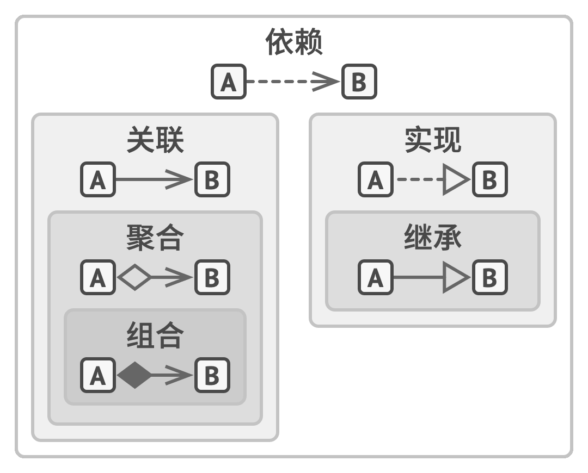

# 设计模式基础介绍及通用原则
## 面对对象程序设计基础
### 对象间的关系

#### 依赖
- 类A依赖于类B
- 描述：对类B的修改会影响到类A
#### 关联
- 类A依赖于类B
- 描述：对象A知道对象B(对象A可以访问对象B的部分接口与实现(包括元素))
#### 聚合
- 类A依赖于类B
- 描述：对象A知道对象B，且对象A由对象B构成
#### 组合
- 类A依赖于类B
- 描述：对象A知道对象B，且对象A由对象B构成，且对象A管理着对象B的生命周期
#### 实现
- 接口(抽象类)B声明的方法由类A定义实现。
- 对象A可视为对象B。
- 类A依赖于类B。
- 描述：类型实现接口（抽象类），可以理解为具体类型A对于抽象概念B的具象化
#### 继承
- 类A继承类B的接口和实现，同时子类A可以对其进行拓展
- 对象A可视为对象B。
- 类A依赖于类B
- 描述：子类继承父类，主要为了代码复用
## 设计模式简介
根据抽象层级由高到低来看
1. 架构模式：可以在任何编程语言中使用，可用于整个应用程序的架构设计
2. 设计模式：针对某些语言未能完美抽象的问题，需要自己根据问题实现这种抽象
3. 算法/惯用技巧：通常只能针对某种语言，有具体的实现样例
### 设计模式包含的内容
1. 意图：描述问题&解决方案
2. 动机：进一步解释问题&说明解决方案的原理
3. 结构：模式各个部分及其之间的关系
4. 语言实现
### 设计模式的分类
#### 从目的看
1. 创建型模式：提供创建对象的机制，增加已有代码的灵活性和可复用性。
2. 结构型模式：介绍如何将对象和类组装成较大的结构，并同时保持结构的灵活和高效。
3. 行为模式：负责对象间沟通和指责委派
#### 从范围看
1. 类模式处理类与子类的静态关系 继承方案
2. 对象模式处理对象间动态关系 组合方案
## 设计原则
### 封装变化的内容
`区分出程序中变化与不变的内容，目的是限制变更造成的影响`  
### 面向接口进行开发，而不是面向实现
`依赖于抽象类型，而不是具体类，抽象出依赖关系并更具依赖关系抽象出抽象类`
1. 确定一个对象对另一个对象的确切需求：它需要执行哪些方法？
2. 用一个新的接口或抽象类中描述这些方法
3. 让被依赖的类实现该接口
4. 现在让有需求的类依赖于这个接口， 而不依赖于具体的类。你仍可与原始类中的对象进行互动，但现在其连接将会灵活得多。
### 组合(聚合)优于继承
继承的问题
1. 子类不能减少父类的接口
2. 在重写方法时， 你需要确保新行为与其基类中的版本兼容。
3. 继承打破了超类的封装
4. 子类与超类紧密耦合
5. 通过继承复用代码可能导致不同维度继承体系的产生，从而导致子类组合数量爆炸
## SOLID原则
### 单一职责原则
- `修改一个类的原因只能有一个`
- 可用于检测
- 如果主要指责变得模糊，则可以进行拆分，分给成员中新的类
### 开放/封闭原则
- `对于扩展，类应该是开放的；对于修改，类应该是封闭的`，目的是实现新功能时，保持已有代码不变  
- 这条原则并不能应用于所有对类进行的修改中。如果你发现类中存在缺陷，直接对其进行修复即可，不要为它创建子类。子类不应该对其父类的问题负责。同时这条原则也可以用作“面向接口进行开发，而不时面向实现”和“封装变化的内容”原则的检验。一旦在设计阶段分离出了需要扩展变化的类，他就时开放的，而稳定的类就是封闭的
### 里氏替换原则
- `当你扩展一个类时， 记住你应该要能在不修改客户端代码的情况下将子类的对象作为父类对象进行传递。`
- 可以用于检验父/子类的抽象关系是否合适
- 因为子类必须保持于父类行为的兼容，所以重写父类的方法时要对父类的行为进行扩展，而不是完全替换。此原则可以用子类能否与代码兼容及能否与父类对象协作的测试来验证。
- 此原则还包含一系列对子类的形式要求
  1.  子类方法的参数类型必须与其超类的参数类型相匹配或更加抽象(即方法输入更具开放性)
  2.  子类方法的返回值类型必须与超类方法的返回值类型或是其子类别相匹配(即方法输出更具封闭性)
  3.  子类中的方法不应抛出基础方法预期之外的异常类型(即方法输出的错误更具封闭性)
  4.  子类不应该加强其前置条件(即方法输入更具开放性)
  5.  子类不能削弱其后置条件(即方法输出更具封闭性)
  6.  超类的不变量必须保留(扩展一个类的最安全做法是引入新的成员变量和方法，而不要去招惹超类中已有的成员。当然在实际中，这并非总是可行。)
  7.  子类不能修改超类中私有成员变量的值
### 接口隔离原则
- `实现接口的类不应被强迫依赖于其不使用的方法`
- 尽量拆分接口的功能，使得实现接口的类可选择性地仅实现其需要的行为。
- 不要进一步划分已经非常具体的接口。记住，创建的接口越多，代码就越复杂。因此要保持平衡。
### 依赖倒置原则
- `高层次的类不应该依赖于低层次的类。 两者都应该依赖于抽象接口。 抽象接口不应依赖于具体实现。 具体实现应该依赖于抽象接口`
- 通常在设计软件时，你可以辨别出不同层次的类。
  - 低层次类:实现基础操作（例如磁盘操作、传输网络数据和连接数据库等）。
  - 高层次类:包含复杂业务逻辑以指导低层次类执行特定操作
- 可以使用业务术语来创建高层次接口类，其依赖的低层次操作。一旦低层次的类实现了这些接口，它们将依赖于业务逻辑层，从而倒置了原始的依赖关系。
- 依赖倒置原则通常和`开闭原则`共同发挥作用：你无需修改已有类就能用不同的业务逻辑类扩展低层次的类。