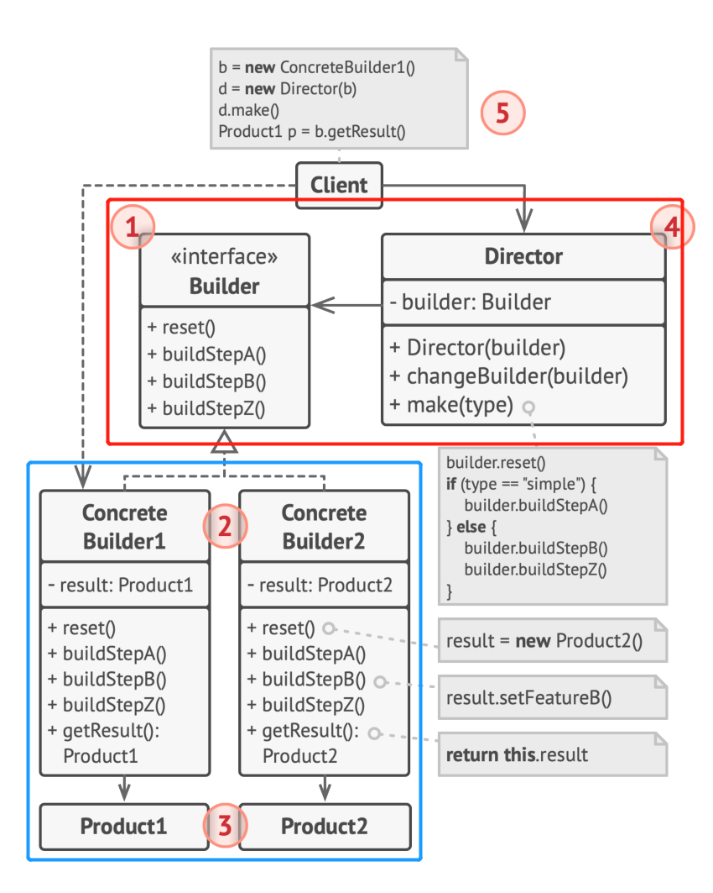

# 创建型模式-生成器（构建器）
"对象创建"模式
通过对象创建模式绕开new（过早地确定具体类型），来避免对象创建过程中所导致的紧耦合，从而支持对象类型的晚绑定，以及模块代码对象创建的稳定。他是接口抽象之后的第一步工作
- Factory Method:最基本的创建型模式，延迟对象创建时对象类型的绑定
- Abstract Factory: 创建一系列关联的对象
- Prototype: 从一个原型对象克隆出其他对象
- **Builder**: 可以某种程度上定制创建对象的算法，模板方法在创建类型时的应用
## 动机
对于某些类型，创建其对象时具有**稳定的**算法步骤但其中的算法是**变化的**的（模板方法在创建类型时的应用）
## 实现
