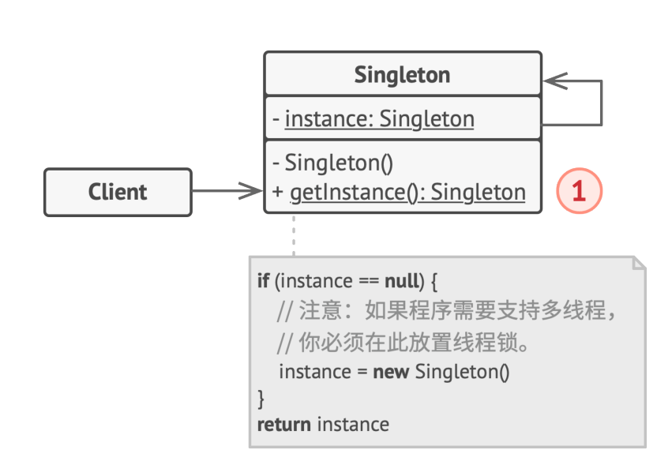

# 创建型模式-单例模式
"对象性能"模式
面向对象解决了抽象问题，但付出了一定的性能代价。通过"对象性能"模式消除一部分性能代价。
- **Singleton**：对象创建全局只需要一个时使用此模式
- Flyweight：使用共享(池)的方式
## 动机
逻辑（业务）上或性能上只需要一个这样的类存在
## 实现

## 细节
要注意多并发中的线程安全
```C++
// 多线程不安全
Singleton* Singleton::getInstance() {
    if (m_instance == nullptr) {
        m_instance = new Singleton();
    }
    return m_instance;
}

// 线程安全，但锁的代价过高
Singleton* Singleton::getInstance() {
    Lock lock;
    if (m_instance == nullptr) {
        m_instance = new Singleton();
    }
    return m_instance;
}

// double check 双检查锁，但由于内存读写reorder不安全 
Singleton* Singleton::getInstance() {
    if (m_instance == nullptr) {
        Lock lock;
        if (m_instance == nullptr)
        {
            m_instance = new Singleton();
        }
    }
    return m_instance;
}

// c++ 11版本后的跨平台线程安全实现(volatile)
std::atomic<Singleton*> Singleton::m_instance;
std::mutex Singleton::m_mutex;

Singleton* Singleton::getInstance() {
    Singleton* tmp = m_instance.load(std::memory_order_relaxed);
    std::atomic_thread_fence(std::memory_order_acquire); // 获取内存fence
    if (m_instance == nullptr) {
        std::lock_guard<std::mutex> lock(m_mutex);
        tmp = m_instance.load(std::memory_order_relaxed);
        if (tmp == nullptr)
        {
            tmp = new Singleton();
            std::atomic_thread_fence(std::memory_order_release);
            m_instance.store(tmp, std::memory_order_relaxed);
        }
    }
    return tmp;
}
```