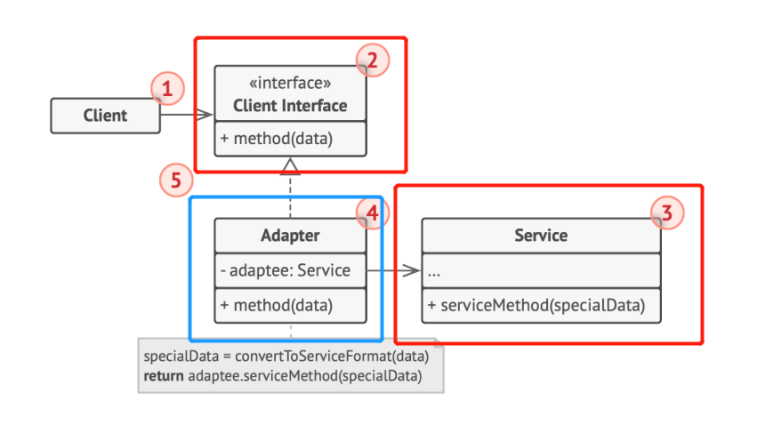

# 结构型模式 - 适配器模式
接口隔离模式
在组件构建过程中，某些接口间直接的依赖常常会有很多问题。通过添加一层间接（稳定）接口，来隔离本来互相紧密关联的接口。
- Facade：隔离系统内与系统外的耦合
- Mediator：隔离系统内部的过度耦合
- Proxy：为复杂的操作接口提供间接的访问
- **Adapter**：用适配器适配原始的接口为新的可用接口

## 动机
将一个**稳定的**原始的接口用适配器模式转化为新的**稳定的**接口。常用于对遗留代码的复用中

## 实现

## 细节
对象适配器（组合）比类适配器（多继承）好