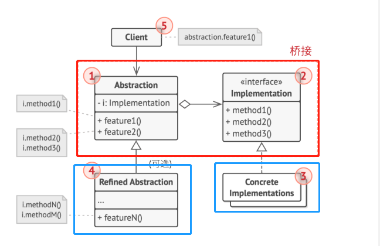

# 结构型模式 - 桥接
单一职责模式
在软件组件设计过程中，如果责任划分不清晰，使用继承得到的结果往往是随着需求变化的，子类急剧膨胀，同时充斥着重复代码，这时候的关键是划清责任。反过来看，大量充斥重复代码的时候说明有很多类干着同样的工作，也就说明了类的职责不单一，要通过划清职责来解决。而划清职责的手段就是合理利用继承（稳定）和组合（变化）
- Decorator ：通过组合方式分化不同于继承的另一个方向的变化
- **Bridge** ：通过拆分类再组合的方式分化不同方向的变化

## 动机
原始类有多个**变化维度**（特别是两个维度时），可以将原始类拆分为两个类提供**变化**。最终通过组合合并将一个类合并到另一个主体类上。

## 实现
