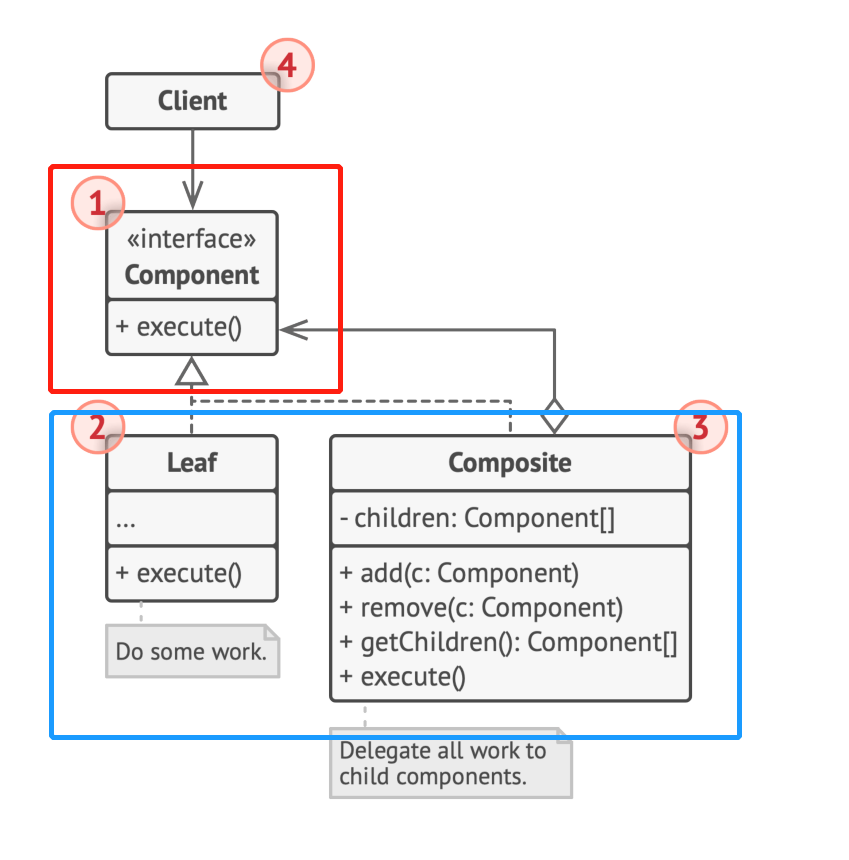

# 结构型模式 - 组合模式
数据结构模式
常常有一些组件在内部有特定的数据结构组成，如果让客户程序依赖这些特定的数据结构，将极大地破坏组件的复用。通过数据结构模式，将这些数据结构组成封装在内部，对外部保持一个统一的接口，来实现与特定数据结构无关的访问
- **Composite**：树形结构统一组合对象和单个对象
- Iterator：为遍历不同的对象集合提供统一的操作接口
- Chain of Resposiblity：将处理行为组成一个链表结构，对单一请求对象进行处理

## 动机
用树形结构将**变化的**类型封装，使得可以用**稳定的**操作对单个对象和组合对象进行一致的访问

## 实现
