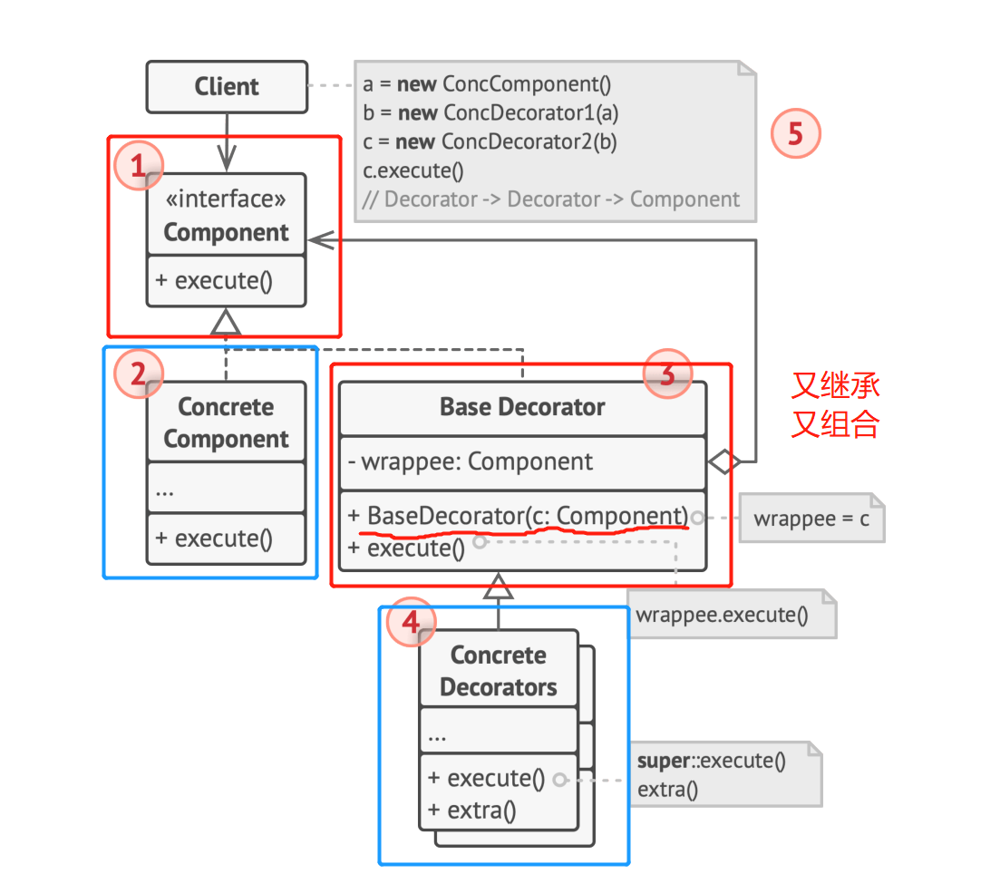

# 结构型模式-装饰
单一职责模式
在软件组件设计过程中，如果责任划分不清晰，使用继承得到的结果往往是随着需求变化的，子类急剧膨胀，同时充斥着重复代码，这时候的关键是划清责任。反过来看，大量充斥重复代码的时候说明有很多类干着同样的工作，也就说明了类的职责不单一，要通过划清职责来解决。而划清职责的手段就是合理利用继承（稳定）和组合（变化）
## 问题
通过扩展来更改一个对象的行为时，如果单纯的扩展它所属的类，则会面对如果类的行为是已有行为的组合，一个新扩展的类对应一种新的组合，则使得扩展数量爆炸，同时这样将导致修改困难
## 动机
继承适用于主体功能的**变化**，而面对一些**变化**的拓展功能可以使用组合方案，结合两种方案应对两个方向上的变化，达成拓展功能的运行时装配
## 实现

## 应用到的原则
1. 组合优于继承
2. 单一职责原则: 继承的非Decorator类负责主体功能，组合的Decorator类负责拓展功能
## 解决方案
1. 使用聚合和组合，而不是继承
2. 装饰器（封装器）是一个能与其他目标的对象连接的对象，其包含与目标对象相同的接口。在具体装饰器中实现对连接的其他目标的方法的委派
## 抽象
1. 将类的组合抽象为基础（抽象）装饰类来进行组合
## 适用场景
1. 在无需修改代码的情况下即可使用对象，且希望在运行时为对象新增额外的行为，可以使用装饰模式
2. 扩展对象行为时，继承方案不可行，可使用装饰模式
## 优点
1. 无需创建新子类即可通过组合扩展对象行为
2. 可通过多层装饰器来组合多个行为
3. 可在运行时添加或删除对象的功能
4. 单一指责原则。可以将实现了不同行为的大类拆分为多个单一指责的小类