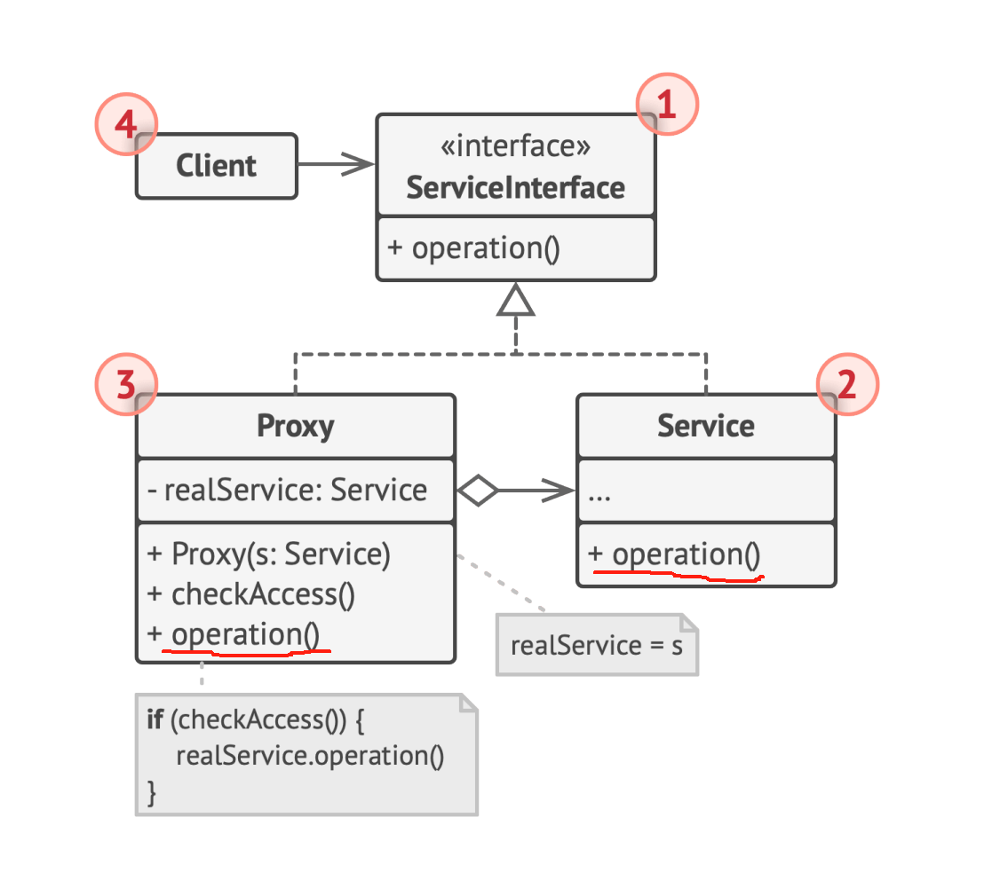

# 结构型模式 - 代理模式
接口隔离模式
在组件构建过程中，某些接口间直接的依赖常常会有很多问题。通过添加一层间接（稳定）接口，来隔离本来互相紧密关联的接口。
- Facade：隔离系统内与系统外的耦合
- Mediator：隔离系统内部的过度耦合
- **Proxy**：为复杂的操作接口提供间接的访问
- Adapter：用适配器适配原始的接口为新的可用接口
## 动机
对于某些对象，具有**稳定的**操作接口，**变化的**复杂的操作实现（如分布式和本地两种）。可以用代理模式实现这种**稳定的**操作接口让使用者可以间接访问
## 实现

## 细节
