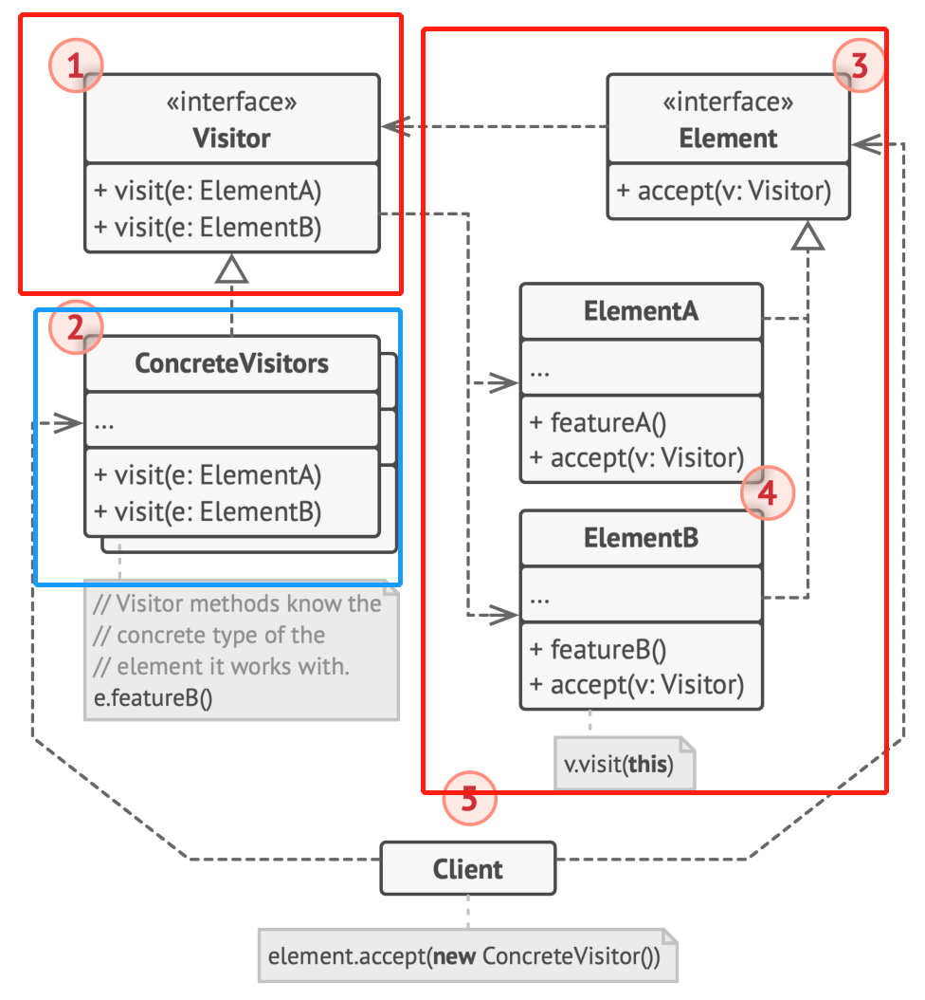

# 行为型模式 - 访问者
行为变化模式
在组件构建过程中，组件行为的变化常常需要组件本身改变。行为模式是将行为和组件本身解耦，使得组件行为的变化不改变组件本身
- Command：将对对象的行为抽象为一个行为（函数）对象
- **Visitor**：类的行为可能面临需求变更，预留一个可访问类的接口以供未来添加行为
## 动机
**稳定的**类层次结构（类与其他类的继承组合关系），对类对象的操作是**变化的**（在Command模式的情况下，类对象也存在变化的可能, 但类层次结构不变）
## 实现

## 代码实现
### C++
dive_design_patterns\C++\src\Visitor\Conceptual\main.cc
## 细节
使用访问者模式代价很重，有严苛的前提条件
1. 稳定的Element类层次结构，不允许添加新的子类
2. 可预见的会添加对对象的新的操作