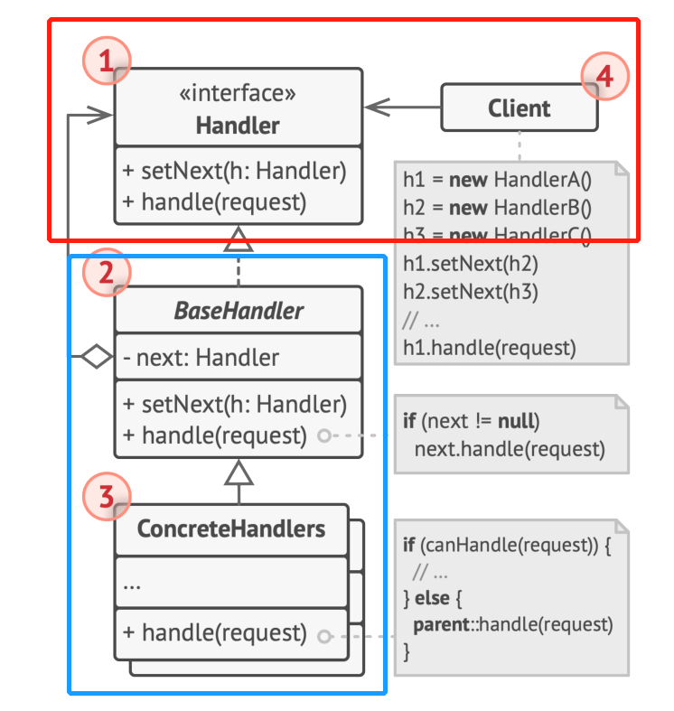

# 行为型模式 - 责任链
数据结构模式
常常有一些组件在内部有特定的数据结构组成，如果让客户程序依赖这些特定的数据结构，将极大地破坏组件的复用。通过数据结构模式，将这些数据结构组成封装在内部，对外部保持一个统一的接口，来实现与特定数据结构无关的访问
- Composite：：通过树形结构统一对组合对象和单个对象的操作接口
- Iterator：为遍历不同的对象集合提供统一的操作接口
- **Chain of Resposiblity**：将处理行为组成一个链表结构，对单一请求对象进行处理

## 动机
**稳定的**请求对象，**变化的**处理行为流程，隔离了请求对象和处理流程

## 实现

## 代码实现
vpp中的graph node框架，请求对象就是frame
