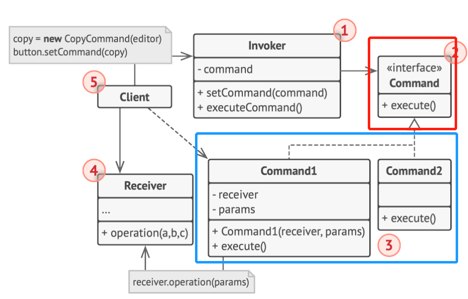

# 行为型模式-命令模式
行为变化模式
在组件构建过程中，组件行为的变化常常需要组件本身改变。行为模式是将行为和组件本身解耦，使得组件行为的变化不改变组件本身
- **Command**：将对对象的行为抽象为一个行为（函数）对象
- Visitor：类的行为可能面临需求变更，预留一个可访问类的接口以供未来添加行为
## 动机
**稳定的**待操作对象，灵活**变化的**操作行为（以及操作行为的组合）和其他上下文（receiver/其他参数）
## 实现

## 代码实现
### C++
dive_design_patterns\C++\src\Command\Conceptual\main.cc
## 细节
C++中可以使用函数对象性能更高（编译时绑定），command（运行时绑定）