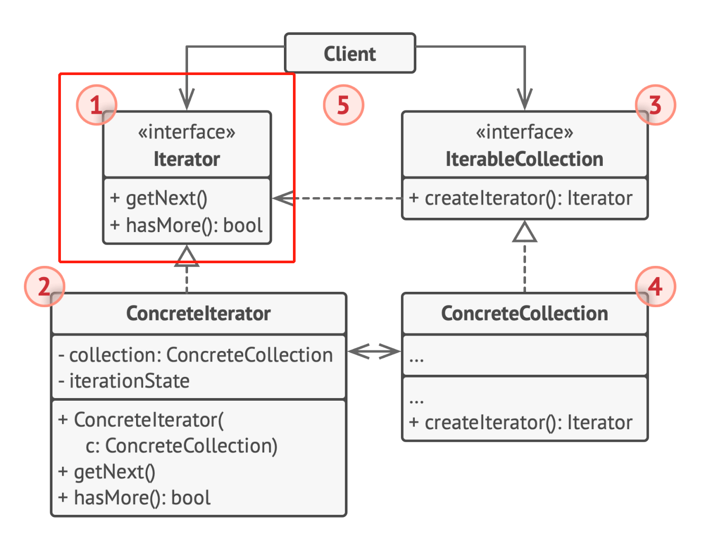

# 行为型模式 - 迭代器
数据结构模式
常常有一些组件在内部有特定的数据结构组成，如果让客户程序依赖这些特定的数据结构，将极大地破坏组件的复用。通过数据结构模式，将这些数据结构组成封装在内部，对外部保持一个统一的接口，来实现与特定数据结构无关的访问
- Composite：：通过树形结构统一对组合对象和单个对象的操作接口
- **Iterator**：为遍历不同的对象集合提供统一的操作接口
- Chain of Resposiblity：将处理行为组成一个链表结构，对单一请求对象进行处理

## 动机
用**稳定**的迭代接口隔离**变化的**算法和**变化的**对象容器（对象组织方式）

## 实现

## 细节
迭代器操作时不应更改迭代器操作的集合对象，不然容易造成问题