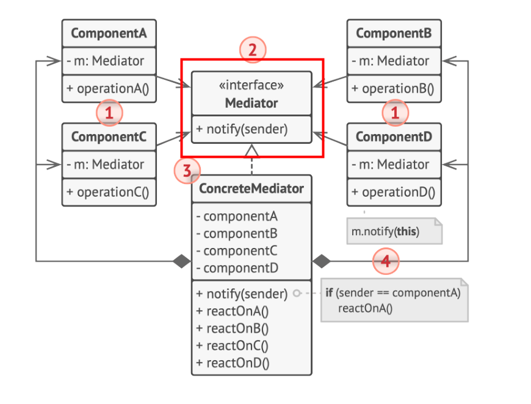

# 行为型模式 - 中介者模式
接口隔离模式
在组件构建过程中，某些接口间直接的依赖常常会有很多问题。通过添加一层间接（稳定）接口，来隔离本来互相紧密关联的接口。
- Facade
- Proxy
- Adapter
- **Mediator**
## 动机
解决系统内多个对象相互关联且**变化的**关系，用中介者模式对这些关系解耦
## 实现

解耦了ComponentX之间的关系
## 细节
系统内多个对象的关系是否真的复杂是否真的需要Mediator