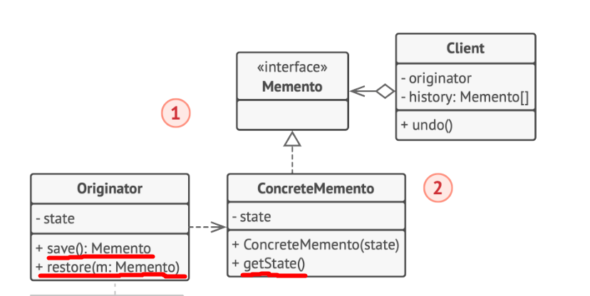

# 行为型模式 - 备忘录模式
状态变化类
某些对象的状态经常面临变化，状态的变化又可能造成行为的变化，如何对变化进行有效的管理，同时又维持高层模块的稳定？
- State: 对状态的变化过程进行管理
- **Memento**: 对状态的保存与恢复（撤销redo）

## 动机
对某些对象的状态有保存恢复的需求

## 实现

## 细节
1. Originator的save和restore接口可能实现的比较复杂，因为要考虑高效安全