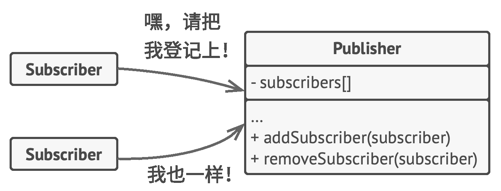
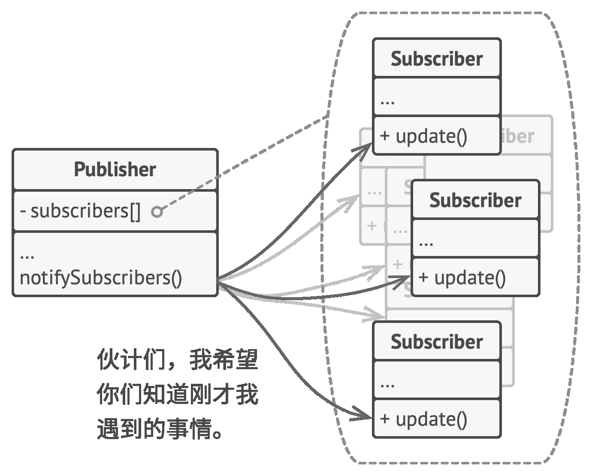

# 行为型模式-观察者
## 问题
1. 消息发送方（发布者）和接收方（订阅者）的交互模式
2. 不同的发布者类和不同的订阅者类耦合
## 解决方案

- 为发布者类添加订阅机制（实现订阅抽象接口），接收方对象通过订阅接口订阅和取消订阅

- 为订阅者添加被通知机制（实现被通知抽象接口，接口中声明通知方法及其参数，这样发布者的消息还可以带一些上下文内容），发布者对象通过被通知接口与订阅者交互
# 适用场景
- 当一个对象的状态改变需要改变其他对象，或实际对象是事先未知的或动态变化的
- 当应用中的一些对象必须观察其他对象时
# 优点
1. 开闭原则。无需修改发布者代码就可以引入新的订阅者
2. 可运行时建立对象间的联系
