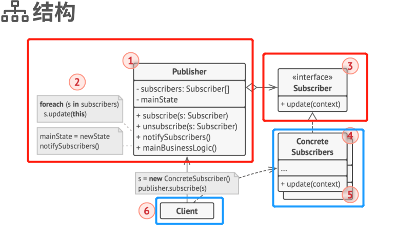
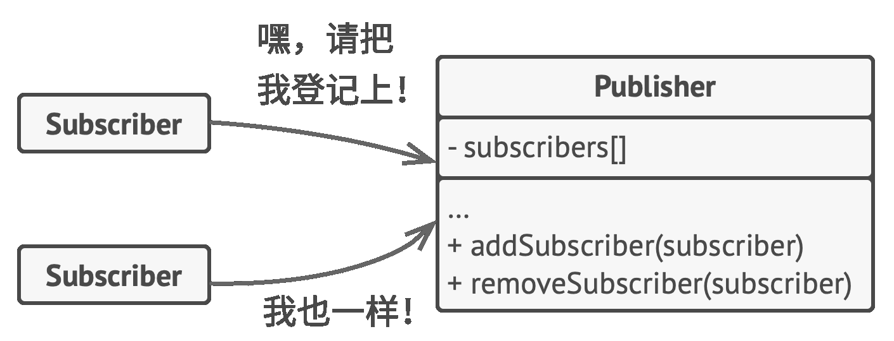
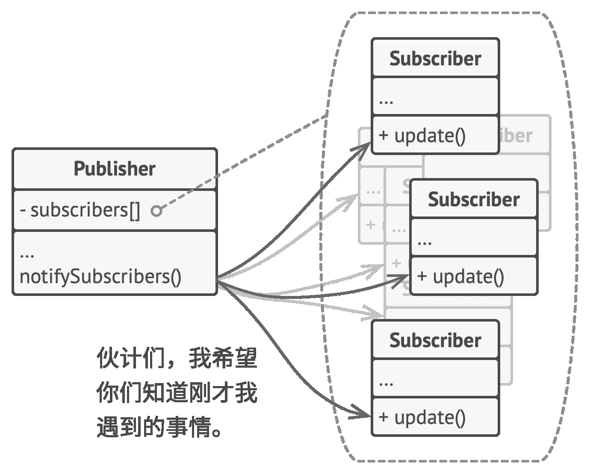

# 行为型模式-观察者
- Template Method ：稳定的算法框架中存在某些可改变的单一步骤
- Strategy ：同一类对象中不同的对象使用不同的策略
- **Observer** ：事件通知

## 动机
在某些系统存在事件及其观察者(即通知依赖关系)的时候，存在**稳定的**事件上下文，**变化的**（且多个）观察者（及观察者应对事件的行为）

## 实现

- 为发布者类添加订阅机制（实现订阅抽象接口），接收方对象通过订阅接口订阅和取消订阅

- 为订阅者添加被通知机制（实现被通知抽象接口，接口中声明通知方法及其参数，这样发布者的消息还可以带一些上下文内容），发布者对象通过被通知接口与订阅者交互
