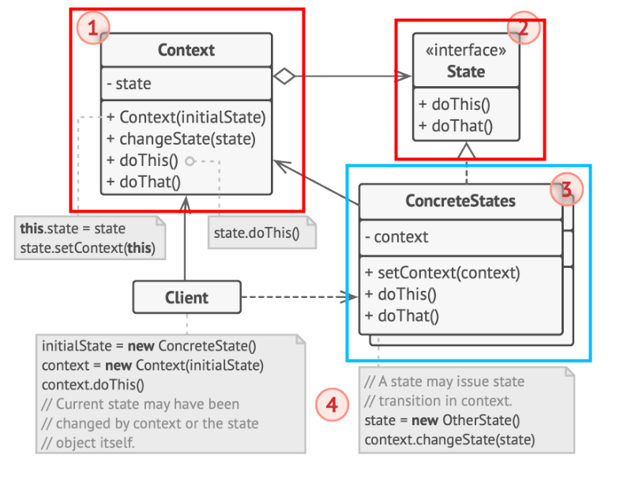

# 行为型模式 - 状态模式
状态变化类
某些对象的状态经常面临变化，如何对变化进行有效的管理，同时又维持高层模块的稳定？
- **State**: 对状态的变化过程进行管理
- Memento: 对状态的保存与恢复（撤销redo）
## 动机
处理**变化的**状态（运行时变化的状态和需求变化的状态类型），状态对象自行封装状态的跃迁行为以实现状态转移接口
## 实现

## 代码实现
### C++
dive_design_patterns\C++\src\State\Conceptual\main.cc & old_main.cc