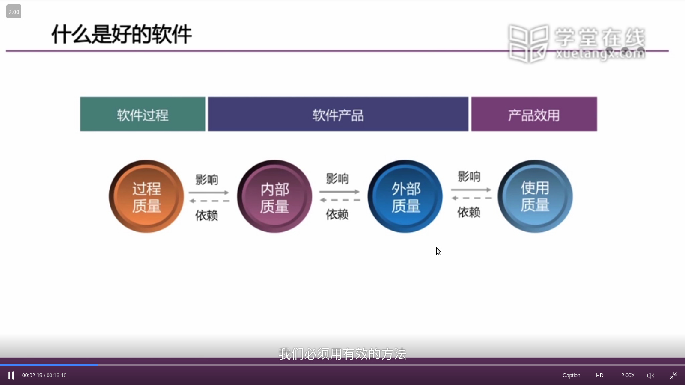

# ch1 初始软件工程
## 1.2 软件的本质特性
1. 复杂性
2. 一致性
3. 可变性
4. 不可见性
## 1.4 软件工程基本概念
1. 过程：一系列开发活动
2. 方法：面向过程->面向对象->面向构件->面向服务（复用程度提高）
3. 工具：与开发活动对应的工具
### 软件开发基本策略
1. 软件复用:包括库函数、类库、模板、设计模式、组件、框架等，后续的课程会提到
2. 分而治之
3. 逐步演进
4. 优化折中
## 1.5 软件质量
